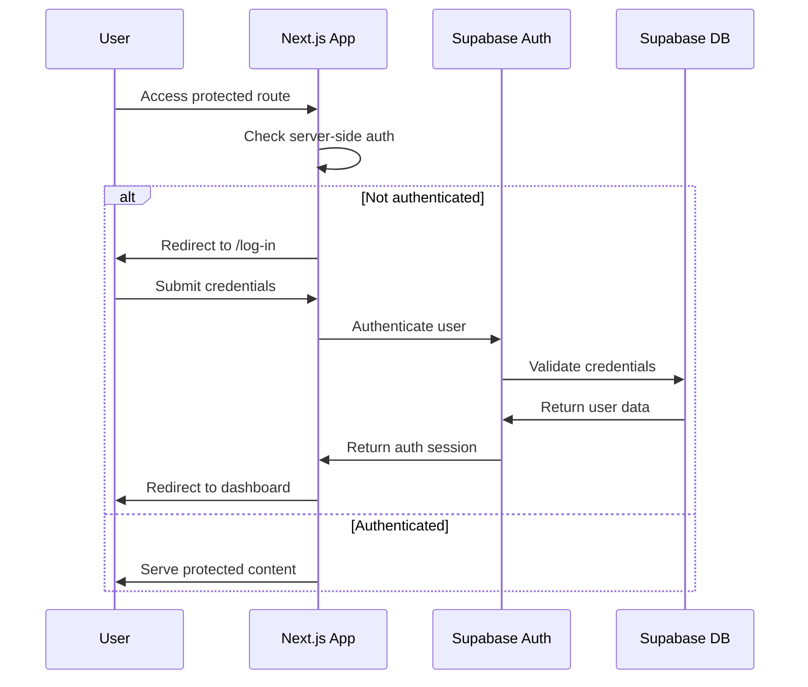
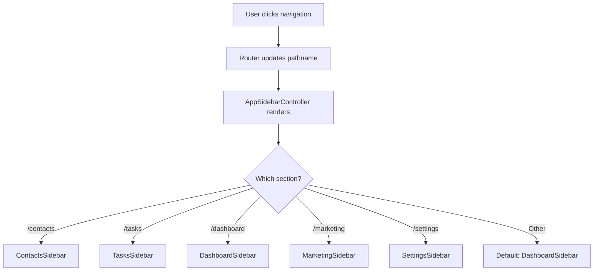

# CodexCRM Architecture Documentation

## 🏗️ System Architecture Overview

CodexCRM is built as a modern, type-safe monorepo using Next.js 15 App Router with React 19, featuring a comprehensive business management platform with enterprise-grade patterns.

## 📁 Application Structure

### Core Directory Layout

```
apps/web/
├── app/                          # Next.js 15 App Router
│   ├── (auth)/                   # Authentication routes
│   │   ├── log-in/              # Login page
│   │   ├── sign-up/             # Registration page
│   │   └── callback/            # OAuth callback handler
│   ├── api/                     # API routes
│   │   ├── auth/                # Supabase auth handlers
│   │   └── trpc/                # tRPC endpoint
│   ├── contacts/                # Contact management section
│   │   ├── [contactId]/         # Dynamic contact routes
│   │   ├── groups/              # Contact groups
│   │   └── import/              # Contact import tools
│   ├── tasks/                   # Task management section
│   ├── dashboard/               # Business analytics
│   ├── calendar/                # Scheduling (planned)
│   ├── messages/                # Communication (planned)
│   ├── marketing/               # Marketing automation
│   ├── analytics/               # Advanced reporting (planned)
│   └── settings/                # System configuration (planned)
├── components/                  # React components
│   ├── layout/                  # Layout components
│   │   ├── MainLayout.tsx       # Primary application layout
│   │   ├── AppSidebarController.tsx  # Sidebar routing logic
│   │   ├── Header.tsx           # Application header
│   │   └── sidebars/            # Contextual sidebars
│   ├── ui/                      # Base UI components (Shadcn)
│   ├── dashboard/               # Business widgets
│   ├── contacts/                # Contact-specific components
│   └── tasks/                   # Task-specific components
└── lib/                         # Utilities and configurations
    ├── auth/                    # Authentication utilities
    ├── trpc.ts                  # tRPC client configuration
    └── utils/                   # Shared utilities
```

## 🔐 Authentication Architecture

### Authentication Flow Diagram



### Authentication Components

**Server-Side Authentication** (`/lib/auth/require-auth.ts`)
```typescript
// Server component authentication helper
export async function requireAuth() {
  const cookieStore = cookies();
  const supabase = createServerClient(/* config */);
  const { data: { user } } = await supabase.auth.getUser();
  if (!user) redirect('/log-in');
  return user;
}
```

**Route Protection Pattern**
```typescript
// Applied to all protected pages
export default async function ProtectedPage() {
  const user = await requireAuth(); // Automatic redirect if unauthenticated
  return <PageContent user={user} />;
}
```

**Session Management**
- JWT tokens stored in HTTP-only cookies
- Automatic token refresh via Supabase client
- Server-side validation on every protected route
- Graceful handling of expired sessions

## 🧭 Navigation Architecture

### Sidebar Controller System

The application uses a declarative sidebar system that renders contextual navigation based on the current route.

```typescript
// AppSidebarController implementation
export function AppSidebarController() {
  const pathname = usePathname();
  
  // Route-based sidebar selection
  if (pathname.startsWith('/contacts')) return <ContactsSidebar />;
  if (pathname.startsWith('/tasks')) return <TasksSidebar />;
  if (pathname.startsWith('/dashboard')) return <DashboardSidebar />;
  // ... additional routes
  
  return <DashboardSidebar />; // Default fallback
}
```

### 8 Main Application Sections

#### 1. Dashboard (`/` and `/dashboard`)
- **Purpose**: Business analytics and KPI overview
- **Sidebar**: DashboardSidebar
- **Components**:
  - BusinessMetricsCard
  - CalendarPreview
  - QuickActions
  - Recent activity widgets

#### 2. Contacts (`/contacts`)
- **Purpose**: Customer relationship management
- **Sidebar**: ContactsSidebar
- **Key Features**:
  - Contact CRUD operations
  - Group management
  - Import/export functionality
  - Custom field support

#### 3. Tasks (`/tasks`)
- **Purpose**: Project and task management
- **Sidebar**: TasksSidebar
- **Key Features**:
  - Kanban board interface
  - Task assignment and tracking
  - Priority and status management
  - Due date and reminder system

#### 4. Calendar (`/calendar`) *[Planned]*
- **Purpose**: Scheduling and appointments
- **Sidebar**: CalendarSidebar
- **Planned Features**:
  - Appointment booking
  - Event management
  - Calendar integration
  - Time blocking

#### 5. Messages (`/messages`) *[Planned]*
- **Purpose**: Communication hub
- **Sidebar**: MessagesSidebar
- **Planned Features**:
  - Internal messaging
  - Email integration
  - SMS communication
  - Communication history

#### 6. Marketing (`/marketing`)
- **Purpose**: Marketing automation and campaigns
- **Sidebar**: MarketingSidebar
- **Features**:
  - Campaign management
  - Customer segmentation
  - Email marketing tools
  - Analytics and reporting

#### 7. Analytics (`/analytics`) *[Planned]*
- **Purpose**: Advanced reporting and insights
- **Sidebar**: AnalyticsSidebar
- **Planned Features**:
  - Custom report builder
  - Data visualization
  - Performance metrics
  - Business intelligence

#### 8. Settings (`/settings`)
- **Purpose**: Account and system configuration
- **Sidebar**: SettingsSidebar
- **Features**:
  - User preferences
  - Account management
  - System configuration
  - Security settings

### Navigation Flow



## 🔗 API Architecture (tRPC)

### tRPC Router Structure

```
packages/server/src/routers/
├── contact.ts              # Contact management endpoints
├── task.ts                 # Task management endpoints
├── group.ts                # Group management endpoints
└── _app.ts                 # Main app router aggregation
```

### API Endpoint Patterns

**Contact Router** (`/api/trpc/contacts`)
```typescript
export const contactRouter = createTRPCRouter({
  // List contacts with pagination and filtering
  list: protectedProcedure
    .input(z.object({
      page: z.number().min(1).default(1),
      limit: z.number().min(1).max(100).default(10),
      search: z.string().optional(),
      groupId: z.string().optional(),
    }))
    .query(async ({ input, ctx }) => {
      // Implementation with Supabase query
    }),

  // Create or update contact
  save: protectedProcedure
    .input(ContactSchema)
    .mutation(async ({ input, ctx }) => {
      // Upsert logic with validation
    }),

  // Delete contact
  delete: protectedProcedure
    .input(z.object({ id: z.string() }))
    .mutation(async ({ input, ctx }) => {
      // Soft delete with referential integrity
    }),
});
```

**Task Router** (`/api/trpc/tasks`)
```typescript
export const taskRouter = createTRPCRouter({
  list: protectedProcedure.input(TaskListSchema).query(/* ... */),
  create: protectedProcedure.input(TaskCreateSchema).mutation(/* ... */),
  update: protectedProcedure.input(TaskUpdateSchema).mutation(/* ... */),
  delete: protectedProcedure.input(z.object({ id: z.string() })).mutation(/* ... */),
  updateStatus: protectedProcedure.input(TaskStatusSchema).mutation(/* ... */),
});
```

### Middleware Architecture

**Authentication Middleware**
```typescript
const protectedProcedure = publicProcedure.use(async ({ ctx, next }) => {
  if (!ctx.user) {
    throw new TRPCError({ code: 'UNAUTHORIZED' });
  }
  return next({ ctx: { ...ctx, user: ctx.user } });
});
```

**Rate Limiting Middleware**
```typescript
const rateLimitedProcedure = protectedProcedure.use(async ({ ctx, next }) => {
  // Implement rate limiting logic
  const isAllowed = await checkRateLimit(ctx.user.id);
  if (!isAllowed) {
    throw new TRPCError({ code: 'TOO_MANY_REQUESTS' });
  }
  return next();
});
```

## 💾 Database Architecture

### Supabase Schema Design

**Core Tables**
```sql
-- Users (managed by Supabase Auth)
-- Contacts
CREATE TABLE contacts (
  id UUID PRIMARY KEY DEFAULT gen_random_uuid(),
  user_id UUID REFERENCES auth.users(id) ON DELETE CASCADE,
  full_name TEXT NOT NULL,
  email TEXT,
  phone TEXT,
  company TEXT,
  title TEXT,
  notes TEXT,
  avatar_url TEXT,
  created_at TIMESTAMPTZ DEFAULT NOW(),
  updated_at TIMESTAMPTZ DEFAULT NOW()
);

-- Contact Groups
CREATE TABLE contact_groups (
  id UUID PRIMARY KEY DEFAULT gen_random_uuid(),
  user_id UUID REFERENCES auth.users(id) ON DELETE CASCADE,
  name TEXT NOT NULL,
  description TEXT,
  color TEXT,
  created_at TIMESTAMPTZ DEFAULT NOW()
);

-- Tasks
CREATE TABLE tasks (
  id UUID PRIMARY KEY DEFAULT gen_random_uuid(),
  user_id UUID REFERENCES auth.users(id) ON DELETE CASCADE,
  title TEXT NOT NULL,
  description TEXT,
  status TEXT DEFAULT 'pending',
  priority TEXT DEFAULT 'medium',
  due_date TIMESTAMPTZ,
  contact_id UUID REFERENCES contacts(id) ON DELETE SET NULL,
  created_at TIMESTAMPTZ DEFAULT NOW(),
  updated_at TIMESTAMPTZ DEFAULT NOW()
);
```

**Row Level Security (RLS)**
```sql
-- Enable RLS for all tables
ALTER TABLE contacts ENABLE ROW LEVEL SECURITY;
ALTER TABLE contact_groups ENABLE ROW LEVEL SECURITY;
ALTER TABLE tasks ENABLE ROW LEVEL SECURITY;

-- Users can only access their own data
CREATE POLICY "Users can manage their own contacts" ON contacts
  FOR ALL USING (auth.uid() = user_id);

CREATE POLICY "Users can manage their own groups" ON contact_groups
  FOR ALL USING (auth.uid() = user_id);

CREATE POLICY "Users can manage their own tasks" ON tasks
  FOR ALL USING (auth.uid() = user_id);
```

## 🎨 UI Architecture

### Component Hierarchy

```
MainLayout
├── Header
│   ├── UserNav
│   └── MobileMenu
├── AppSidebarController
│   ├── ContactsSidebar
│   ├── TasksSidebar
│   ├── DashboardSidebar
│   └── [Other Sidebars]
└── AppContent
    ├── BreadcrumbNavigation
    └── [Page Content]
```

### Design System (Shadcn UI)

**Core Components**
- Button, Input, Textarea (form elements)
- Card, Badge, Avatar (content display)
- Dialog, Sheet, Popover (overlays)
- Table, Pagination (data display)
- Skeleton, Loading Spinner (loading states)

**Custom Components**
- ContactForm (with validation)
- TaskBoard (Kanban interface)
- BusinessMetricsCard (analytics)
- ImageUpload (file handling)

### Responsive Design

**Breakpoint Strategy**
```typescript
// Tailwind breakpoints used throughout
sm: '640px',   // Small devices
md: '768px',   // Medium devices  
lg: '1024px',  // Large devices
xl: '1280px',  // Extra large devices
2xl: '1536px'  // 2x extra large devices
```

**Mobile-First Approach**
- Collapsible sidebar on mobile
- Touch-optimized interactive elements
- Progressive enhancement for larger screens
- Responsive typography and spacing

## ⚡ Performance Architecture

### Bundle Optimization

**Code Splitting Strategy**
```typescript
// Dynamic imports for route-based splitting
const ContactsPage = dynamic(() => import('./contacts/page'), {
  loading: () => <ContactsPageSkeleton />,
});

// Component-level splitting for heavy components
const TaskBoard = dynamic(() => import('./TaskBoard'), {
  loading: () => <TaskBoardSkeleton />,
});
```

**Progressive Loading**
- Skeleton UI for all loading states
- Incremental data loading with pagination
- Image optimization with Next.js Image component
- Lazy loading for non-critical components

### React 19 Concurrent Features

**useTransition for Non-blocking Navigation**
```typescript
function NavigationLink({ href, children }) {
  const [isPending, startTransition] = useTransition();
  const router = useRouter();
  
  const handleClick = () => {
    startTransition(() => {
      router.push(href);
    });
  };
  
  return (
    <button onClick={handleClick} disabled={isPending}>
      {isPending ? <LoadingSpinner /> : children}
    </button>
  );
}
```

**useOptimistic for Instant Updates**
```typescript
function ContactList() {
  const [contacts, setContacts] = useState(initialContacts);
  const [optimisticContacts, addOptimisticContact] = useOptimistic(
    contacts,
    (state, newContact) => [...state, newContact]
  );
  
  const createContact = async (contactData) => {
    addOptimisticContact({ ...contactData, id: 'temp-id' });
    try {
      const savedContact = await api.contacts.save(contactData);
      setContacts(current => [...current, savedContact]);
    } catch (error) {
      // Optimistic update will be reverted automatically
      showErrorToast('Failed to create contact');
    }
  };
}
```

## 🔒 Security Architecture

### Authentication Security

- JWT tokens with automatic refresh
- HTTP-only cookies for token storage
- Server-side session validation
- Secure redirect handling
- CSRF protection via SameSite cookies

### Data Security

- Row Level Security (RLS) in Supabase
- Input validation with Zod schemas
- SQL injection prevention
- XSS protection via React's built-in escaping
- Content Security Policy headers

### API Security

- Rate limiting middleware
- Request validation on all endpoints
- User authorization checks
- Error message sanitization
- Audit logging for sensitive operations

## 📊 Monitoring & Observability

### Error Handling

**Error Boundaries**
```typescript
class ComponentErrorBoundary extends React.Component {
  state = { hasError: false };
  
  static getDerivedStateFromError(error) {
    return { hasError: true };
  }
  
  componentDidCatch(error, errorInfo) {
    // Log to error reporting service
    console.error('Component error:', error, errorInfo);
  }
  
  render() {
    if (this.state.hasError) {
      return <ErrorFallbackUI />;
    }
    return this.props.children;
  }
}
```

**Global Error Handling**
- tRPC error handling with user-friendly messages
- Network error recovery with retry logic
- Graceful degradation for failed components
- Error reporting integration (Sentry ready)

### Performance Monitoring

- Core Web Vitals tracking
- Bundle size monitoring
- Database query performance
- API response time metrics
- User interaction analytics

## 🔄 Data Flow Architecture

### State Management Pattern


**Client-Side State**
- TanStack Query for server state management
- React state for local component state
- URL state for navigation and filters
- Local storage for user preferences

**Server-Side State**
- Supabase database as source of truth
- tRPC procedures for data mutations
- Automatic cache invalidation
- Optimistic updates with rollback

This architecture provides a solid foundation for a scalable, maintainable, and performant business management platform with enterprise-grade security and user experience patterns.