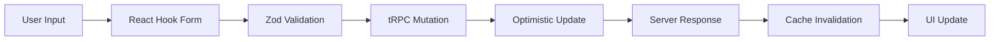

# CodexCRM Component Documentation

## 🧩 Core Components Overview

This document provides detailed documentation for the core layout and business components in the CodexCRM application, focusing on their architecture, usage patterns, and integration points.

## 🏗️ Layout Components

### MainLayout

**Location**: `/apps/web/components/layout/MainLayout.tsx`

**Purpose**: The authoritative application shell that provides the foundational layout structure for the entire application.

**Architecture Pattern**: Floating UI design with responsive sidebar integration

#### Component Structure

```typescript
interface MainLayoutProps {
  children: ReactNode;
}

export default function MainLayout({ children }: MainLayoutProps)
```

#### Key Features

- **SidebarProvider Integration**: Uses Shadcn UI sidebar primitives for responsive behavior
- **Floating Design**: Content appears to float above page background with padding
- **Responsive Header**: Adaptive height based on sidebar state
- **Breadcrumb Navigation**: Contextual navigation with hierarchical display
- **Mobile Optimization**: Collapsible sidebar for mobile devices

#### Implementation Details

```typescript
// Core layout structure
<SidebarProvider>
  <AppSidebarController />          {/* Dynamic sidebar routing */}
  <SidebarInset className="p-4">   {/* Main content area */}
    <header>                        {/* Application header */}
      <SidebarTrigger />           {/* Mobile menu toggle */}
      <Breadcrumb />               {/* Navigation breadcrumb */}
    </header>
    <MainSectionNav />             {/* Section-specific navigation */}
    {children}                     {/* Page content */}
  </SidebarInset>
</SidebarProvider>
```

#### Usage Pattern

```typescript
// Applied to all main application pages
export default function ContactsPage() {
  return (
    <MainLayout>
      <ContactsContent />
    </MainLayout>
  );
}
```

#### Responsive Behavior

- **Desktop**: Full sidebar visible with main content
- **Tablet**: Collapsible sidebar with overlay behavior  
- **Mobile**: Hidden sidebar with hamburger menu trigger
- **Micro**: Optimized for very small screens

---

### AppSidebarController

**Location**: `/apps/web/components/layout/AppSidebarController.tsx`

**Purpose**: Declarative sidebar routing system that renders contextual sidebars based on the current URL path.

#### Component Architecture

```typescript
export function AppSidebarController() {
  const pathname = usePathname();
  
  // Route-based sidebar selection logic
  if (pathname.startsWith('/contacts')) return <ContactsSidebar />;
  if (pathname.startsWith('/tasks')) return <TasksSidebar />;
  // ... additional route mappings
  
  return <DashboardSidebar />; // Default fallback
}
```

#### Sidebar Mapping Table

| Route Pattern | Sidebar Component | Purpose |
|---------------|------------------|----------|
| `/` or `/dashboard` | `DashboardSidebar` | Business overview and quick actions |
| `/contacts` | `ContactsSidebar` | Contact management and groups |
| `/tasks` | `TasksSidebar` | Task management and projects |
| `/calendar` | `CalendarSidebar` | Scheduling and appointments |
| `/messages` | `MessagesSidebar` | Communication hub |
| `/marketing` | `MarketingSidebar` | Campaign management |
| `/analytics` | `AnalyticsSidebar` | Advanced reporting |
| `/settings` | `SettingsSidebar` | System configuration |

#### Loading State Handling

```typescript
// Skeleton loading during initial render
if (!pathname) {
  return <Skeleton className="h-full w-full" />;
}
```

#### Implementation Benefits

- **Performance**: Only renders the required sidebar component
- **Maintainability**: Centralized routing logic for all sidebars
- **Type Safety**: Compile-time checking of route patterns
- **User Experience**: Contextual navigation based on current section

---

### Header Component

**Location**: `/apps/web/components/layout/Header.tsx`

**Purpose**: Application header with user navigation, authentication status, and mobile menu controls.

#### Key Features

- **User Authentication Display**: Shows current user status and avatar
- **Mobile Menu Integration**: Responsive hamburger menu for mobile devices
- **Quick Actions**: Fast access to common operations
- **Notification Center**: Real-time notifications and alerts
- **Search Integration**: Global search functionality

#### Component Structure

```typescript
export function Header() {
  return (
    <header className="flex h-16 items-center justify-between px-4">
      <div className="flex items-center gap-2">
        <SidebarTrigger />
        <Breadcrumb />
      </div>
      <div className="flex items-center gap-4">
        <SearchBar />
        <NotificationCenter />
        <UserNav />
      </div>
    </header>
  );
}
```

---

### UserNav Component

**Location**: `/apps/web/components/layout/UserNav.tsx`

**Purpose**: User-specific navigation and account management dropdown.

#### Features

- **User Profile Display**: Avatar, name, and email
- **Account Settings**: Quick access to profile and preferences
- **Authentication Actions**: Sign out and account switching
- **Theme Toggle**: Light/dark mode switching
- **Help and Support**: Documentation and support links

#### Implementation

```typescript
export function UserNav() {
  const { user } = useAuth();
  
  return (
    <DropdownMenu>
      <DropdownMenuTrigger asChild>
        <Button variant="ghost" className="relative h-8 w-8 rounded-full">
          <Avatar>
            <AvatarImage src={user?.avatar_url} alt={user?.full_name} />
            <AvatarFallback>{user?.full_name?.[0]}</AvatarFallback>
          </Avatar>
        </Button>
      </DropdownMenuTrigger>
      <DropdownMenuContent>
        {/* Account management options */}
      </DropdownMenuContent>
    </DropdownMenu>
  );
}
```

## 📞 Business Components

### ContactForm

**Location**: `/apps/web/app/contacts/ContactForm.tsx`

**Purpose**: Comprehensive contact creation and editing form with validation and image upload capabilities.

#### Form Architecture

- **React Hook Form**: Form state management and validation
- **Zod Schema**: Type-safe input validation
- **Optimistic Updates**: Instant UI feedback with error rollback
- **Image Upload**: Profile picture upload with preview
- **Auto-save**: Periodic saving of form data

#### Validation Schema

```typescript
const contactFormSchema = z.object({
  full_name: z.string().min(1, 'Name is required'),
  email: z.string().email('Invalid email').optional(),
  phone: z.string().optional(),
  company_name: z.string().optional(),
  job_title: z.string().optional(),
  // ... additional fields
});
```

#### Form Implementation

```typescript
export function ContactForm({ contact, onSave }: ContactFormProps) {
  const form = useForm<ContactFormData>({
    resolver: zodResolver(contactFormSchema),
    defaultValues: contact || defaultContactValues,
  });
  
  const mutation = api.contacts.save.useMutation({
    onMutate: (variables) => {
      // Optimistic update logic
    },
    onError: (error) => {
      // Error handling and rollback
    },
    onSuccess: (data) => {
      // Success handling and cache invalidation
    },
  });
  
  return (
    <Form {...form}>
      <form onSubmit={form.handleSubmit(mutation.mutate)}>
        {/* Form fields */}
      </form>
    </Form>
  );
}
```

#### Features

- **Real-time Validation**: Field-level validation with instant feedback
- **Conditional Fields**: Dynamic form fields based on contact type
- **Bulk Import**: CSV and Excel file import capabilities
- **Duplicate Detection**: Automatic detection of potential duplicates
- **Custom Fields**: Support for user-defined contact fields

---

### TaskBoard

**Location**: `/apps/web/app/tasks/TaskBoard.tsx`

**Purpose**: Kanban-style task management interface with drag-and-drop functionality.

#### Board Architecture

```typescript
interface TaskBoardProps {
  tasks: Task[];
  onTaskUpdate: (taskId: string, updates: Partial<Task>) => void;
  onTaskCreate: (taskData: CreateTaskData) => void;
}

export function TaskBoard({ tasks, onTaskUpdate, onTaskCreate }: TaskBoardProps)
```

#### Column Configuration

- **Pending**: New tasks awaiting action
- **In Progress**: Currently active tasks
- **Review**: Tasks pending review or approval
- **Completed**: Finished tasks

#### Drag and Drop Implementation

```typescript
// React DnD integration for task movement
const [{ isDragging }, drag] = useDrag({
  type: 'task',
  item: { id: task.id, status: task.status },
  collect: (monitor) => ({
    isDragging: monitor.isDragging(),
  }),
});

const [{ isOver }, drop] = useDrop({
  accept: 'task',
  drop: (item: { id: string; status: TaskStatus }) => {
    if (item.status !== columnStatus) {
      onTaskUpdate(item.id, { status: columnStatus });
    }
  },
  collect: (monitor) => ({
    isOver: monitor.isOver(),
  }),
});
```

#### Features

- **Real-time Collaboration**: Live updates from multiple users
- **Task Filtering**: Filter by assignee, priority, due date
- **Bulk Operations**: Select and update multiple tasks
- **Keyboard Navigation**: Full keyboard accessibility
- **Mobile Optimization**: Touch-friendly drag and drop

---

### BusinessMetricsCard

**Location**: `/apps/web/components/dashboard/business-metrics/BusinessMetricsCard.tsx`

**Purpose**: Display key business metrics with trend analysis and interactive charts.

#### Metrics Categories

- **Revenue Metrics**: Monthly/quarterly revenue tracking
- **Contact Metrics**: New contacts, engagement rates
- **Task Metrics**: Completion rates, productivity analysis
- **Marketing Metrics**: Campaign performance, conversion rates

#### Component Structure

```typescript
interface BusinessMetricsCardProps {
  title: string;
  value: number | string;
  change?: number;
  changeType?: 'positive' | 'negative' | 'neutral';
  icon?: React.ComponentType;
  chartData?: ChartDataPoint[];
}

export function BusinessMetricsCard({
  title,
  value,
  change,
  changeType,
  icon: Icon,
  chartData
}: BusinessMetricsCardProps) {
  return (
    <Card>
      <CardHeader className="flex flex-row items-center justify-between">
        <CardTitle className="text-sm font-medium">{title}</CardTitle>
        {Icon && <Icon className="h-4 w-4 text-muted-foreground" />}
      </CardHeader>
      <CardContent>
        <div className="text-2xl font-bold">{value}</div>
        {change && (
          <p className={`text-xs ${getChangeColor(changeType)}`}>
            {change > 0 ? '+' : ''}{change}% from last month
          </p>
        )}
        {chartData && <MiniChart data={chartData} />}
      </CardContent>
    </Card>
  );
}
```

---

## 🎨 UI Components

### Shared UI Library

**Location**: `/apps/web/components/ui/`

**Purpose**: Consistent, reusable UI components based on Shadcn UI and Radix primitives.

#### Core Components

- **Form Elements**: Input, Textarea, Select, Checkbox, Radio
- **Navigation**: Button, Link, Breadcrumb, Pagination
- **Data Display**: Table, Card, Badge, Avatar
- **Feedback**: Alert, Toast, Dialog, Loading Spinner
- **Layout**: Sidebar, Sheet, Popover, Tabs

#### Component Conventions

```typescript
// Consistent prop interface pattern
interface ComponentProps {
  children?: ReactNode;
  className?: string;
  variant?: 'default' | 'secondary' | 'destructive';
  size?: 'sm' | 'md' | 'lg';
}

// Forward ref pattern for all form elements
const Input = React.forwardRef<HTMLInputElement, InputProps>(
  ({ className, type, ...props }, ref) => {
    return (
      <input
        type={type}
        className={cn(inputVariants(), className)}
        ref={ref}
        {...props}
      />
    );
  }
);
```

#### Theming System

```typescript
// CSS variables for consistent theming
:root {
  --background: 0 0% 100%;
  --foreground: 240 10% 3.9%;
  --primary: 240 5.9% 10%;
  --primary-foreground: 0 0% 98%;
  // ... additional theme variables
}

// Dark mode overrides
.dark {
  --background: 240 10% 3.9%;
  --foreground: 0 0% 98%;
  // ... dark theme variables
}
```

---

## 📊 Data Flow Patterns

### Form Data Flow



### Component Communication

- **Props Down**: Data flows down through component hierarchy
- **Events Up**: User actions bubble up through callback props
- **Global State**: TanStack Query for server state management
- **Local State**: React useState for component-specific state

### Error Boundary Strategy

```typescript
// Component-level error boundaries
class ComponentErrorBoundary extends Component {
  state = { hasError: false };
  
  static getDerivedStateFromError(error: Error) {
    return { hasError: true };
  }
  
  componentDidCatch(error: Error, errorInfo: ErrorInfo) {
    // Log error to monitoring service
    console.error('Component error:', error, errorInfo);
  }
  
  render() {
    if (this.state.hasError) {
      return <ErrorFallback onRetry={() => this.setState({ hasError: false })} />;
    }
    return this.props.children;
  }
}
```

## 🔧 Development Patterns

### Component Development Guidelines

1. **Single Responsibility**: Each component has one clear purpose
2. **Composition Over Inheritance**: Build complex UIs through composition
3. **Props Interface**: Clear, typed interfaces for all props
4. **Accessibility**: WCAG 2.1 AA compliance with proper ARIA labels
5. **Performance**: Memo optimization for expensive components

### Testing Patterns

```typescript
// Component testing with React Testing Library
describe('ContactForm', () => {
  it('should validate required fields', async () => {
    render(<ContactForm onSave={jest.fn()} />);
    
    fireEvent.click(screen.getByRole('button', { name: 'Save' }));
    
    expect(await screen.findByText('Name is required')).toBeInTheDocument();
  });
  
  it('should submit valid form data', async () => {
    const onSave = jest.fn();
    render(<ContactForm onSave={onSave} />);
    
    fireEvent.change(screen.getByLabelText('Full Name'), {
      target: { value: 'John Doe' }
    });
    fireEvent.click(screen.getByRole('button', { name: 'Save' }));
    
    await waitFor(() => {
      expect(onSave).toHaveBeenCalledWith({
        full_name: 'John Doe',
        // ... additional expected data
      });
    });
  });
});
```

### Performance Optimization

- **React.memo**: Memoize expensive components
- **useMemo**: Cache expensive calculations
- **useCallback**: Stable function references
- **Lazy Loading**: Dynamic imports for heavy components
- **Virtual Scrolling**: For large data lists

This component documentation provides a comprehensive guide to the core components, their relationships, usage patterns, and development guidelines for maintaining consistency and quality across the CodexCRM application.