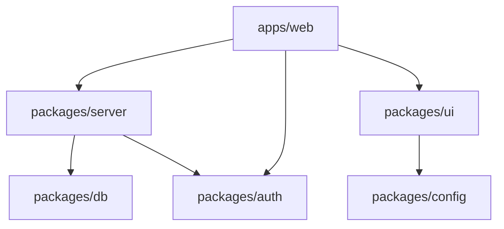

# Current Monorepo Structure Analysis
Date: $(date)

## Package Inventory
### @codexcrm/auth
Path: packages/auth
Dependencies:

### @codexcrm/config
Path: packages/config
Dependencies:

### @codexcrm/db
Path: packages/db
Dependencies:

### @codexcrmapp/jobs
Path: packages/jobs
Dependencies:

### @codexcrm/server
Path: packages/server
Dependencies:
  - @codexcrm/db

### @codexcrm/ui
Path: packages/ui
Dependencies:


## Dependency Graph


## Issues to Address

1. Relative path imports (../../ patterns)
2. Package naming (db vs database)
3. Shared configs not in config package
4. UI components scattered

## Migration Priorities

1. Consolidate configs into packages/config
2. Standardize package names
3. Fix import paths
4. Extract more UI components
## Relative Import Audit
```
apps/_web_phase0_complete_20250623_141549/app/contacts/[contactId]/ContactDetailView.tsx:import type { Tables } from '../../../../../packages/db/src/database.types';
apps/_web_phase0_complete_20250623_141549/app/contacts/[contactId]/edit/page.tsx:import type { Tables } from '../../../../../../packages/db/src/database.types'; // Import Tables type
apps/_web_phase0_complete_20250623_141549/app/contacts/ContactGroupTags.tsx:import type { Tables } from '../../../../packages/db/src/database.types';
apps/_web_phase0_complete_20250623_141549/app/contacts/_components/table/components/ContactTableHeader.tsx:import { getColumnDefinition } from '../constants';
apps/_web_phase0_complete_20250623_141549/app/contacts/_components/table/components/ContactTableHeader.tsx:import type { Contact } from '../types';
apps/_web_phase0_complete_20250623_141549/app/contacts/_components/table/components/ContactsTable.tsx:} from '../hooks';
apps/_web_phase0_complete_20250623_141549/app/contacts/_components/table/components/ContactsTable.tsx:import type { ContactsTableProps } from '../types';
apps/_web_phase0_complete_20250623_141549/app/contacts/_components/table/components/ContactActions.tsx:import type { Contact, ContactActionProps } from '../types';
apps/_web_phase0_complete_20250623_141549/app/contacts/_components/table/components/ProfileAvatar.tsx:import type { Contact } from '../types';
apps/_web_phase0_complete_20250623_141549/app/contacts/_components/table/components/index.ts:export type { ContactActionProps } from '../types';
apps/_web_phase0_complete_20250623_141549/app/contacts/_components/table/components/ContactTableRow.tsx:import { getColumnDefinition } from '../constants';
apps/_web_phase0_complete_20250623_141549/app/contacts/_components/table/components/ContactTableRow.tsx:import type { Contact } from '../types';
apps/_web_phase0_complete_20250623_141549/app/contacts/_components/table/components/ContactTableBody.tsx:import type { Contact } from '../types';
apps/_web_phase0_complete_20250623_141549/app/contacts/_components/table/hooks/useContactActions.ts:import type { Contact, ContactActionsHook } from '../types';
apps/_web_phase0_complete_20250623_141549/app/contacts/_components/table/hooks/useBulkOperations.ts:import type { BulkOperationsHook, BulkOperationState } from '../types';
apps/_web_phase0_complete_20250623_141549/app/contacts/_components/table/hooks/useContactSelection.ts:import type { Contact, ContactSelectionHook } from '../types';
apps/_web_phase0_complete_20250623_141549/app/contacts/_components/table/hooks/index.ts:} from '../types';
apps/_web_phase0_complete_20250623_141549/app/contacts/_components/table/hooks/useColumnManagement.ts:import type { ColumnManagementHook, TableState } from '../types';
apps/_web_phase0_complete_20250623_141549/app/contacts/_components/table/hooks/useColumnManagement.ts:import { DEFAULT_COLUMN_ORDER } from '../constants';
apps/_web_phase0_complete_20250623_141549/app/actions/contact-actions.ts:import { contactSchema } from '../contacts/ContactForm';
```
