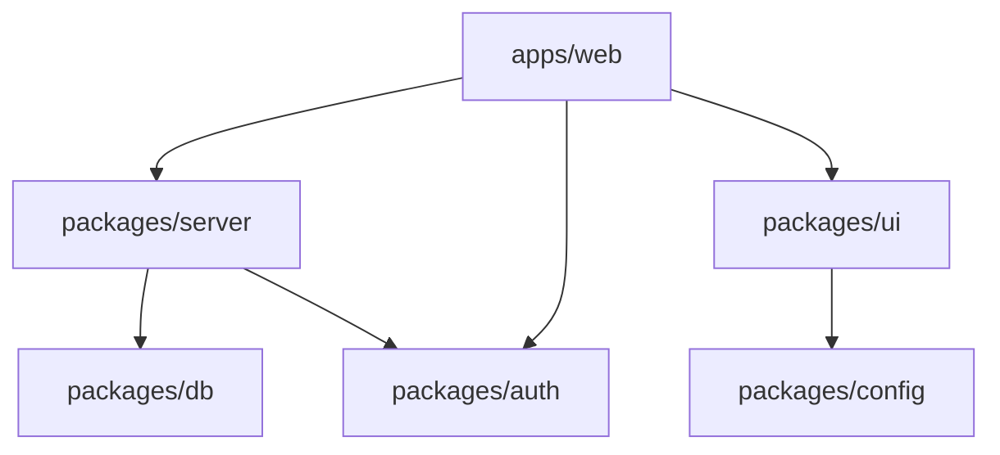

# Current Monorepo Structure Analysis
Date: $(date)

## Package Inventory
### @codexcrm/auth
Path: packages/auth
Dependencies:

### @codexcrm/config
Path: packages/config
Dependencies:

### @codexcrm/database
Path: packages/database
(Renamed from @codexcrm/db)
Dependencies:

### @codexcrm/background-jobs
Path: packages/background-jobs
Dependencies:

### @codexcrm/server
Path: packages/server
Dependencies:
  - @codexcrm/db

### @codexcrm/ui
Path: packages/ui
Dependencies:


## Dependency Graph


## Package Naming Convention

Our audit reveals inconsistent package naming patterns:

### Current Pattern

| Package | Current Name | Status |
|---------|--------------|--------|
| auth    | @codexcrm/auth | ✅ Correct |
| config  | @codexcrm/config | ✅ Correct |
| db      | @codexcrm/db | ✅ Correct |
| jobs    | @codexcrm/background-jobs | ✅ Corrected |
| server  | @codexcrm/server | ✅ Correct |
| ui      | @codexcrm/ui | ✅ Correct |

### Standardized Pattern

**The correct package naming convention is `@codexcrm/*`** for all packages. The `@codexcrmapp` namespace is legacy and should be replaced.

## Issues to Address

1. Relative path imports (../../ patterns)
   - Cross-package imports using relative paths instead of aliases (`@codexcrm/*`)  
   - In-package components using deeply nested relative paths instead of aliases (`@/*`)
   - Affects 51 files across all packages (counted and verified)
   - Two types: cross-package imports (more critical) and intra-package imports
2. Package naming inconsistency
   - ✅ Fixed: Package naming standardized to `@codexcrm/jobs`
   - **Standard namespace is `@codexcrm`**; `@codexcrmapp` is legacy and should not be used
3. Shared configs not in config package
   - Configuration scattered across packages instead of centralized in `@codexcrm/config`
4. UI components scattered
   - UI components in both `apps/web` and `packages/ui`
   - No clear separation between application-specific and reusable components

## Migration Priorities

1. Consolidate configs into packages/config
2. Standardize package names
3. Fix import paths
4. Extract more UI components
## Relative Import Audit

Files with incorrect import patterns that need to be fixed. These are categorized by package/module to provide a clear picture of where refactoring is needed.

### 1. Next.js Web App (`apps/web`)

#### Cross-Package Imports (should use `@codexcrm/*` aliases)
```
# Database Types Imports (should use @codexcrm/db instead of relative paths)
apps/web/app/contacts/[contactId]/ContactDetailView.tsx: import type { Tables } from '../../../../../packages/db/src/database.types'
apps/web/app/contacts/[contactId]/edit/page.tsx: import type { Tables } from '../../../../../../packages/db/src/database.types'
apps/web/app/contacts/ContactGroupTags.tsx: import type { Tables } from '../../../../packages/db/src/database.types'

# trpc Client Setup (should use @codexcrm/server instead)
apps/web/lib/trpc.ts: import { AppRouter } from '../../packages/server/src/root'
```

#### Internal Relative Imports (should use `@/*` aliases)
```
# Component Imports
apps/web/app/actions/contact-actions.ts: import { contactSchema } from '../contacts/ContactForm'

# Table Components
apps/web/app/contacts/_components/table/components/ContactTableHeader.tsx: import { getColumnDefinition } from '../constants'
apps/web/app/contacts/_components/table/components/ContactTableHeader.tsx: import type { Contact } from '../types'
apps/web/app/contacts/_components/table/components/ContactsTable.tsx: import { useContactSelection, useBulkOperations, useColumnManagement } from '../hooks'
apps/web/app/contacts/_components/table/components/ContactsTable.tsx: import type { ContactsTableProps } from '../types'
apps/web/app/contacts/_components/table/components/ContactActions.tsx: import type { Contact, ContactActionProps } from '../types'
apps/web/app/contacts/_components/table/components/ProfileAvatar.tsx: import type { Contact } from '../types'
apps/web/app/contacts/_components/table/components/index.ts: export type { ContactActionProps } from '../types'
apps/web/app/contacts/_components/table/components/ContactTableRow.tsx: import { getColumnDefinition } from '../constants'
apps/web/app/contacts/_components/table/components/ContactTableRow.tsx: import type { Contact } from '../types'
apps/web/app/contacts/_components/table/components/ContactTableBody.tsx: import type { Contact } from '../types'

# Table Hooks
apps/web/app/contacts/_components/table/hooks/useContactActions.ts: import type { Contact, ContactActionsHook } from '../types'
apps/web/app/contacts/_components/table/hooks/useBulkOperations.ts: import type { BulkOperationsHook, BulkOperationState } from '../types'
apps/web/app/contacts/_components/table/hooks/useContactSelection.ts: import type { Contact, ContactSelectionHook } from '../types'
apps/web/app/contacts/_components/table/hooks/index.ts: export type { Contact, ContactActionsHook, BulkOperationsHook, ContactSelectionHook, ColumnManagementHook } from '../types'
apps/web/app/contacts/_components/table/hooks/useColumnManagement.ts: import type { ColumnManagementHook, TableState } from '../types'
apps/web/app/contacts/_components/table/hooks/useColumnManagement.ts: import { DEFAULT_COLUMN_ORDER } from '../constants'
```

### 2. Server Package (`packages/server`)

#### Internal Relative Imports (should use better module structure)
```
# Middleware Imports
packages/server/src/middleware/auth.middleware.ts: import { router, publicProcedure } from '../trpc'
packages/server/src/middleware/auth.middleware.ts: import type { Context } from '../context'
packages/server/src/middleware/index.ts: export { isAuthenticated, hasRole, isOwner } from './auth.middleware'
packages/server/src/middleware/logging.middleware.ts: import type { Context } from '../context'
packages/server/src/middleware/validation.middleware.ts: import type { Context } from '../context'

# Router Imports
packages/server/src/routers/contact.ts: import { z } from '../validation'
packages/server/src/routers/contact.ts: import { router, protectedProcedure } from '../trpc'
packages/server/src/routers/dashboard.ts: import { router, protectedProcedure } from '../trpc'
packages/server/src/routers/group.ts: import { router, protectedProcedure } from '../trpc'
packages/server/src/routers/session.ts: import { router, protectedProcedure } from '../trpc'
packages/server/src/routers/import.ts: import { router, protectedProcedure } from '../trpc'
packages/server/src/routers/note.ts: import { router, protectedProcedure } from '../trpc'
packages/server/src/routers/storage.ts: import { router, protectedProcedure } from '../trpc'
packages/server/src/routers/ai-action.ts: import { router, protectedProcedure } from '../trpc'

# Utility Imports
packages/server/src/routes/openapi.ts: import { appRouter } from '../root'
packages/server/src/utils/openapi.ts: import type { OpenApiMeta } from '../types'
```

### 3. Database Package (`packages/db`)

```
packages/db/src/repositories/contacts-repository.ts: import type { ContactCreate } from '../types'
packages/db/src/utils/db-helpers.ts: import type { Database } from '../database.types'
```

### 4. UI Package (`packages/ui`)

```
packages/ui/src/components/core/Button.tsx: import { Button } from '../ui/button'
packages/ui/src/components/core/ContactCardDemo.tsx: import { ContactCard } from '../ui/contact-card'
packages/ui/src/components/core/MetricCardDemo.tsx: import { MetricCard } from '../ui/metric-card'
packages/ui/src/components/core/TaskCardDemo.tsx: import { TaskCard } from '../ui/task-card'
packages/ui/src/components/core/ThemeDemo.tsx: import { ThemeProvider } from '../ui/themed-card'
packages/ui/src/components/core/ThemeProvider.tsx: import { getThemeStyles } from '../utils/theme-utils'
packages/ui/src/components/core/TimelineDemo.tsx: import { Timeline } from '../ui/timeline'
packages/ui/src/components/ui/avatar.tsx: import { Avatar as AvatarPrimitive } from '../primitives/avatar'
packages/ui/src/components/ui/contact-card.tsx: import { Card } from '../primitives/card'
packages/ui/src/components/ui/loading-spinner.tsx: import { Spinner } from '../primitives/spinner'
packages/ui/src/components/ui/metric-card.tsx: import { Card } from '../primitives/card'
packages/ui/src/components/ui/responsive-layout.tsx: import { Grid } from '../primitives/grid'
packages/ui/src/components/ui/task-card.tsx: import { Card } from '../primitives/card'
packages/ui/src/components/ui/themed-card.tsx: import { ThemeContext } from '../context/theme-context'
packages/ui/src/components/ui/timeline.tsx: import { TimelineItem } from '../primitives/timeline'
```
