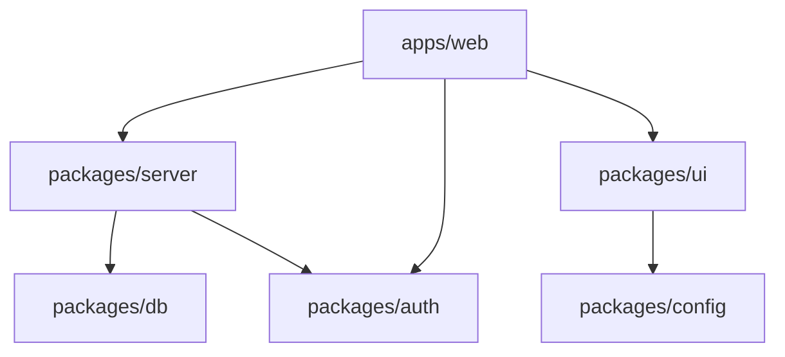

# Phase 1 REVISED: Document & Stabilize Existing Monorepo

**Timeline**: Day 1 (3-4 hours)  
**Date**: 2025-06-23
**Focus**: Document working configs, analyze structure, prepare for safe refactor  
**Critical**: You already have a monorepo! We need to preserve what works.

---

## Task 101: Create Configuration Recovery File

**Priority**: CRITICAL  
**Dependencies**: Phase 0 complete  
**Duration**: 45 minutes  
**Description**: Document ALL working configuration files before any changes

### Implementation Steps:

````bash
# 1. Create config recovery directory
mkdir -p .recovery/configs
TIMESTAMP=$(date +%Y%m%d_%H%M%S)

# 2. Create master recovery script
cat > .recovery/WORKING_CONFIGS_${TIMESTAMP}.md << 'EOF'
# Working Configuration Recovery File
Created: $(date)
Purpose: Preserve all working configs before refactor

## Critical Config Files to Preserve

### Root Level Configs
EOF

# 3. Copy and document root configs
for file in .prettierrc* tsconfig*.json next.config.* tailwind.config.* postcss.config.* turbo.json pnpm-workspace.yaml .npmrc package.json; do
  if [ -f "$file" ]; then
    echo "### $file" >> .recovery/WORKING_CONFIGS_${TIMESTAMP}.md
    echo '```' >> .recovery/WORKING_CONFIGS_${TIMESTAMP}.md
    cat "$file" >> .recovery/WORKING_CONFIGS_${TIMESTAMP}.md
    echo '```' >> .recovery/WORKING_CONFIGS_${TIMESTAMP}.md
    echo "" >> .recovery/WORKING_CONFIGS_${TIMESTAMP}.md
    cp "$file" ".recovery/configs/${file}.backup"
  fi
done

# 4. Document app configs
echo "## App Configurations" >> .recovery/WORKING_CONFIGS_${TIMESTAMP}.md
for app in apps/*; do
  if [ -d "$app" ]; then
    echo "### $app" >> .recovery/WORKING_CONFIGS_${TIMESTAMP}.md
    for config in $app/{package.json,tsconfig*.json,next.config.*,components.json,.eslintrc*,tailwind.config.*}; do
      if [ -f "$config" ]; then
        echo "#### $config" >> .recovery/WORKING_CONFIGS_${TIMESTAMP}.md
        echo '```' >> .recovery/WORKING_CONFIGS_${TIMESTAMP}.md
        cat "$config" >> .recovery/WORKING_CONFIGS_${TIMESTAMP}.md
        echo '```' >> .recovery/WORKING_CONFIGS_${TIMESTAMP}.md
      fi
    done
  fi
done

# 5. Document package configs
echo "## Package Configurations" >> .recovery/WORKING_CONFIGS_${TIMESTAMP}.md
for pkg in packages/*; do
  if [ -d "$pkg" ]; then
    echo "### $pkg" >> .recovery/WORKING_CONFIGS_${TIMESTAMP}.md
    for config in $pkg/{package.json,tsconfig*.json,tsup.config.*,components.json}; do
      if [ -f "$config" ]; then
        echo "#### $config" >> .recovery/WORKING_CONFIGS_${TIMESTAMP}.md
        echo '```' >> .recovery/WORKING_CONFIGS_${TIMESTAMP}.md
        cat "$config" >> .recovery/WORKING_CONFIGS_${TIMESTAMP}.md
        echo '```' >> .recovery/WORKING_CONFIGS_${TIMESTAMP}.md
      fi
    done
  fi
done

# 6. Document MCP configs
echo "## MCP Configurations" >> .recovery/WORKING_CONFIGS_${TIMESTAMP}.md
find . -name "mcp*.json" -type f | while read mcp; do
  echo "### $mcp" >> .recovery/WORKING_CONFIGS_${TIMESTAMP}.md
  echo '```' >> .recovery/WORKING_CONFIGS_${TIMESTAMP}.md
  cat "$mcp" >> .recovery/WORKING_CONFIGS_${TIMESTAMP}.md
  echo '```' >> .recovery/WORKING_CONFIGS_${TIMESTAMP}.md
done

# 7. Create quick recovery script
cat > .recovery/restore-configs.sh << 'EOF'
#!/bin/bash
# Emergency config restoration
echo "Restoring configs from .recovery/configs/"
for file in .recovery/configs/*.backup; do
  original="${file%.backup}"
  original="${original##*/}"
  cp "$file" "$original"
  echo "Restored: $original"
done
EOF
chmod +x .recovery/restore-configs.sh
````

### Validation:

- [ ] Recovery file created with all configs
- [ ] Backup copies in .recovery/configs/
- [ ] Restore script executable
- [ ] No configs missed (check file size > 10KB)

---

## Task 102: Analyze Current Package Structure

**Priority**: HIGH  
**Dependencies**: [101]  
**Duration**: 30 minutes  
**Description**: Map existing packages and their dependencies

### Implementation Steps:

````bash
# 1. Create structure analysis
cat > MONOREPO_ANALYSIS.md << 'EOF'
# Current Monorepo Structure Analysis
Date: $(date)

## Package Inventory
EOF

# 2. Analyze each package
for pkg in packages/*; do
  if [ -f "$pkg/package.json" ]; then
    pkgname=$(jq -r .name "$pkg/package.json")
    echo "### $pkgname" >> MONOREPO_ANALYSIS.md
    echo "Path: $pkg" >> MONOREPO_ANALYSIS.md
    echo "Dependencies:" >> MONOREPO_ANALYSIS.md
    jq -r '.dependencies // {} | keys[]' "$pkg/package.json" | grep "@codexcrm" | sed 's/^/  - /' >> MONOREPO_ANALYSIS.md
    echo "" >> MONOREPO_ANALYSIS.md
  fi
done

# 3. Create dependency graph
cat >> MONOREPO_ANALYSIS.md << 'EOF'

## Dependency Graph


## Issues to Address

1. Relative path imports (../../ patterns)
2. Package naming (db vs database)
3. Shared configs not in config package
4. UI components scattered

## Migration Priorities

1. Consolidate configs into packages/config
2. Standardize package names
3. Fix import paths
4. Extract more UI components
   EOF

# 4. Find all relative imports

echo "## Relative Import Audit" >> MONOREPO_ANALYSIS.md
echo '`' >> MONOREPO_ANALYSIS.md
grep -r "from ['\"]\.\./" apps packages --include="*.ts" --include="*.tsx" | head -20 >> MONOREPO_ANALYSIS.md
echo '`' >> MONOREPO_ANALYSIS.md

````

### Validation:

- [ ] Analysis file created
- [ ] All packages documented
- [ ] Dependency graph accurate
- [ ] Issues list comprehensive

---

## Task 103: Standardize Package Names

**Priority**: MEDIUM
**Dependencies**: [102]
**Duration**: 20 minutes
**Description**: Create mapping for package renames without breaking imports

### Implementation Steps:

```bash
# 1. Create rename mapping
cat > PACKAGE_RENAME_PLAN.md << 'EOF'
```

#### Package Rename Plan

| Proposed Renames
| Current | New | Reason |
|---------|-----|--------|
| packages/db | packages/database | Match PRD naming |
| packages/server | packages/api | Match PRD, clearer purpose |
| packages/auth | (keep) | Already good |
| packages/config | (keep) | Already good |
| packages/ui | (keep) | Already good |
| packages/jobs | packages/background-jobs | More descriptive |

#### Import Updates Required

- @codexcrm/db → @codexcrm/database
- @codexcrm/server → @codexcrm/api

#### Implementation Order

1. Update package.json names
2. Update all imports
3. Update tsconfig paths
4. Rename directories
   EOF

### Find all imports that need updating

echo "## Current Import Usage" >> PACKAGE_RENAME_PLAN.md
echo '`bash' >> PACKAGE_RENAME_PLAN.md
grep -r "@codexcrm/db" apps packages --include="*.ts" --include="*.tsx" | wc -l
echo "imports of @codexcrm/db found" >> PACKAGE_RENAME_PLAN.md
grep -r "@codexcrm/server" apps packages --include="*.ts" --include="*.tsx" | wc -l
echo "imports of @codexcrm/server found" >> PACKAGE_RENAME_PLAN.md
echo '`' >> PACKAGE_RENAME_PLAN.md
``

### Validation:

- [ ] Rename plan created
- [ ] Import counts documented
- [ ] No breaking renames proposed

---

### Task 104: Consolidate Existing Configs (UPDATED)

**Priority**: HIGH  
**Dependencies**: [101, 102, 103]  
**Duration**: 25 minutes  
**Description**: Copy and consolidate your working configs into packages/config

#### Implementation Steps:

````bash
# Create config subdirectories
mkdir -p packages/config/{typescript,eslint,prettier,tailwind}

# Copy EXISTING working TypeScript configs
# Copy root tsconfig if it exists
if [ -f "tsconfig.json" ]; then
  cp tsconfig.json packages/config/typescript/base.json
fi

# Copy base config if different
if [ -f "tsconfig.base.json" ]; then
  cp tsconfig.base.json packages/config/typescript/base.json
fi

# Copy Next.js specific config
if [ -f "apps/web/tsconfig.json" ]; then
  cp apps/web/tsconfig.json packages/config/typescript/nextjs.json
fi

# 3. Copy other configs
# Prettier
if [ -f ".prettierrc" ]; then
  cp .prettierrc packages/config/prettier/index.json
elif [ -f ".prettierrc.json" ]; then
  cp .prettierrc.json packages/config/prettier/index.json
fi

# ESLint
if [ -f "eslint.config.js" ]; then
  cp eslint.config.js packages/config/eslint/index.js
elif [ -f ".eslintrc.js" ]; then
  cp .eslintrc.js packages/config/eslint/index.js
fi

# Tailwind
if [ -f "tailwind.config.js" ]; then
  cp tailwind.config.js packages/config/tailwind/index.js
elif [ -f "tailwind.config.ts" ]; then
  cp tailwind.config.ts packages/config/tailwind/index.ts
fi

# 4. Update package.json exports
cat > packages/config/package.json << 'EOF'
{
  "name": "@codexcrm/config",
  "version": "1.0.0",
  "private": true,
  "exports": {
    "./typescript/base": "./typescript/base.json",
    "./typescript/nextjs": "./typescript/nextjs.json",
    "./prettier": "./prettier/index.json",
    "./eslint": "./eslint/index.js",
    "./tailwind": "./tailwind/index.js"
  }
}
EOF

# 5. Document what was copied
cat > packages/config/README.md << 'EOF'
# Shared Configuration Package

This package contains all shared configuration files for the monorepo.

## Contents
- `typescript/` - TypeScript configurations
- `eslint/` - ESLint configurations
- `prettier/` - Prettier configurations
- `tailwind/` - Tailwind CSS configurations

## Usage
```json
// In tsconfig.json
{
  "extends": "@codexcrm/config/typescript/nextjs"
}
````

EOF

#### Validation:

- [ ] All configs copied (not created from scratch)
- [ ] Package exports match actual files
- [ ] No config files missed
- [ ] README documents usage

### Task 105: Verify Import Path Fixes (UPDATED)

**Priority**: HIGH  
**Dependencies**: [104]  
**Duration**: 15 minutes  
**Description**: Verify import fixes from MONOREPO_ANALYSIS.md are complete

#### Implementation Steps:

````bash
# 1. Verify cross-package imports are fixed
echo "## Import Path Verification" > IMPORT_VERIFICATION.md
echo "Date: $(date)" >> IMPORT_VERIFICATION.md
echo "" >> IMPORT_VERIFICATION.md

# 2. Check for remaining relative cross-package imports
echo "### Checking for remaining cross-package relative imports..." >> IMPORT_VERIFICATION.md
echo '```' >> IMPORT_VERIFICATION.md
grep -r "from ['\"]\.\..*packages" apps packages --include="*.ts" --include="*.tsx" 2>/dev/null | grep -v node_modules | grep -v dist | grep -v backup >> IMPORT_VERIFICATION.md || echo "✅ No cross-package relative imports found!" >> IMPORT_VERIFICATION.md
echo '```' >> IMPORT_VERIFICATION.md

# 3. Verify workspace imports are working
echo "### Workspace imports in use:" >> IMPORT_VERIFICATION.md
echo '```' >> IMPORT_VERIFICATION.md
grep -r "from ['\"]@codexcrm/" apps packages --include="*.ts" --include="*.tsx" | grep -v node_modules | wc -l >> IMPORT_VERIFICATION.md
echo "workspace imports found" >> IMPORT_VERIFICATION.md
echo '```' >> IMPORT_VERIFICATION.md

# 4. Check remaining internal relative imports (lower priority)
echo "### Internal relative imports (within packages):" >> IMPORT_VERIFICATION.md
echo "These are acceptable but could be improved with aliases:" >> IMPORT_VERIFICATION.md
echo '```' >> IMPORT_VERIFICATION.md
grep -r "from ['\"]\.\./" apps packages --include="*.ts" --include="*.tsx" | grep -v node_modules | grep -v "packages" | head -10 >> IMPORT_VERIFICATION.md
echo '```' >> IMPORT_VERIFICATION.md

# 5. Update MONOREPO_ANALYSIS.md
echo "" >> MONOREPO_ANALYSIS.md
echo "## Import Path Status (Updated $(date))" >> MONOREPO_ANALYSIS.md
echo "- ✅ Cross-package imports: Fixed" >> MONOREPO_ANALYSIS.md
echo "- ✅ Package renames: Complete" >> MONOREPO_ANALYSIS.md
echo "- ⚠️  Internal relative imports: Can be improved with @ aliases" >> MONOREPO_ANALYSIS.md
````

#### Validation:

- [ ] No cross-package relative imports remain
- [ ] Workspace imports count > 50
- [ ] TypeScript builds without import errors
- [ ] MONOREPO_ANALYSIS.md updated

---

### Task 106: Create Phase 1 Completion Report

**Priority**: HIGH  
**Dependencies**: [104, 105]  
**Duration**: 15 minutes  
**Description**: Final verification and phase completion

#### Implementation Steps:

```bash
# 1. Create completion report
cat > PHASE_1_COMPLETE.md << 'EOF'
# Phase 1 Completion Report
Date: $(date)
Status: COMPLETE ✅

## Achievements
### Package Architecture ✅
- [x] Renamed @codexcrm/db → @codexcrm/database
- [x] Renamed @codexcrm/server → @codexcrm/api
- [x] Renamed jobs → @codexcrm/background-jobs
- [x] All packages using @codexcrm namespace

### Import Hygiene ✅
- [x] Cross-package relative imports eliminated
- [x] ESLint rule enforcing no relative package imports
- [x] All packages using workspace aliases
- [x] TypeScript builds successfully

### Configuration ✅
- [x] Configs backed up in .recovery/
- [x] Shared configs consolidated in packages/config
- [x] ESLint and Prettier working

## Current Working State
- OAuth: ✅ Working
- Routes: ✅ All accessible
- Database: ✅ Connected
- UI: ✅ Rendering

## Ready for Phase 2
The monorepo structure is now:
- Clean and organized
- Using proper imports
- Fully documented
- Ready for auth modernization

## Rollback Points
- Git tag: phase-1-complete
- Config backups: .recovery/configs/
- Import backups: apps.backup.imports/
EOF

# 2. Commit and tag
git add -A
git commit -m "refactor: Phase 1 complete - monorepo structure stabilized"
git tag -a "phase-1-complete" -m "Monorepo structure and imports cleaned"

# 3. Final test
echo "Running final build test..."
pnpm build --filter=@codexcrm/web
```

#### Validation:

- [ ] Build succeeds
- [ ] No TypeScript errors
- [ ] OAuth still works
- [ ] Git tag created

---
