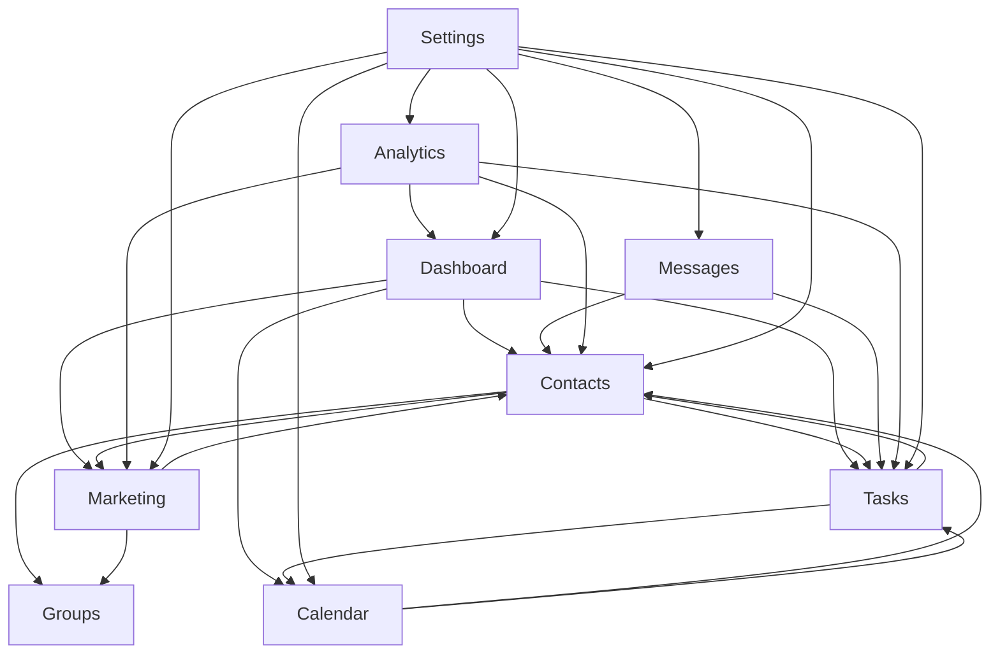

# CodexCRM Sections Overview

## 📋 Application Sections & Relationships

CodexCRM is organized into 8 main business sections, each with specialized functionality and contextual navigation. This document details the purpose, features, and relationships between sections.

## 🗺️ Section Relationship Map



## 📊 Section Details

### 1. Dashboard (`/` and `/dashboard`)

**Purpose**: Central business overview and analytics hub

**Key Features**:
- Real-time business metrics and KPIs
- Recent activity feed
- Quick action shortcuts
- Calendar preview widget
- Contact activity summary
- Task completion statistics

**Navigation Structure**:
```
/dashboard
├── / (default dashboard view)
├── /metrics (detailed analytics)
└── /reports (business reports)
```

**Relationships**:
- **Contacts**: Shows recent contact activity, top contacts
- **Tasks**: Displays task completion metrics, overdue tasks
- **Calendar**: Preview of upcoming appointments
- **Marketing**: Campaign performance metrics
- **Analytics**: Summary of detailed analytics

**Sidebar Configuration**: `DashboardSidebar`
- Quick Actions
- Recent Activities
- Business Metrics
- Calendar Preview
- System Status

---

### 2. Contacts (`/contacts`)

**Purpose**: Comprehensive customer relationship management

**Key Features**:
- Contact CRUD operations (Create, Read, Update, Delete)
- Contact groups and segmentation
- Custom field management
- Contact activity history
- Import/export functionality
- Search and filtering
- Contact relationship mapping

**Navigation Structure**:
```
/contacts
├── / (contact list)
├── /[contactId] (individual contact view)
├── /[contactId]/edit (contact editing)
├── /groups (group management)
├── /groups/[groupId] (group detail view)
└── /import (contact import tools)
```

**Relationships**:
- **Tasks**: Tasks can be assigned to contacts
- **Groups**: Contacts can be organized into groups
- **Marketing**: Contacts are targets for marketing campaigns
- **Calendar**: Contacts can have scheduled appointments
- **Messages**: Communication history with contacts

**Sidebar Configuration**: `ContactsSidebar`
- All Contacts
- Recent Contacts
- Contact Groups
- Import/Export Tools
- Search Filters

---

### 3. Tasks (`/tasks`)

**Purpose**: Project and task management with workflow automation

**Key Features**:
- Kanban board interface
- Task assignment and tracking
- Priority and status management
- Due date and reminder system
- Task dependencies
- Time tracking
- Project organization
- Task templates

**Navigation Structure**:
```
/tasks
├── / (task board/list view)
├── /[taskId] (individual task view)
├── /[taskId]/edit (task editing)
├── /projects (project organization)
└── /templates (task templates)
```

**Relationships**:
- **Contacts**: Tasks can be linked to specific contacts
- **Calendar**: Tasks with due dates appear in calendar
- **Dashboard**: Task metrics feed into dashboard analytics
- **Messages**: Task-related communication
- **Analytics**: Task performance and productivity metrics

**Sidebar Configuration**: `TasksSidebar`
- Task Board
- My Tasks
- Assigned Tasks
- Projects
- Task Templates
- Filters (Status, Priority, Due Date)

---

### 4. Calendar (`/calendar`) *[Planned]*

**Purpose**: Scheduling, appointments, and time management

**Planned Features**:
- Calendar view (day, week, month)
- Appointment booking
- Event management
- Meeting scheduling
- Recurring events
- Calendar sharing
- Integration with external calendars
- Time blocking

**Navigation Structure**:
```
/calendar
├── / (calendar view)
├── /events (event management)
├── /appointments (appointment booking)
├── /availability (availability settings)
└── /integrations (calendar integrations)
```

**Relationships**:
- **Contacts**: Appointments can be scheduled with contacts
- **Tasks**: Tasks with due dates appear in calendar
- **Dashboard**: Upcoming events preview
- **Messages**: Meeting-related communication
- **Marketing**: Event-based marketing campaigns

**Sidebar Configuration**: `CalendarSidebar`
- Calendar Views
- My Calendar
- Shared Calendars
- Upcoming Events
- Appointment Types
- Calendar Settings

---

### 5. Messages (`/messages`) *[Planned]*

**Purpose**: Centralized communication hub

**Planned Features**:
- Internal messaging system
- Email integration
- SMS communication
- Communication history
- Message templates
- Automated responses
- Message scheduling
- Communication preferences

**Navigation Structure**:
```
/messages
├── / (message inbox)
├── /compose (new message)
├── /templates (message templates)
├── /history (communication history)
└── /settings (communication preferences)
```

**Relationships**:
- **Contacts**: Direct communication with contacts
- **Tasks**: Task-related messaging
- **Calendar**: Meeting and appointment communication
- **Marketing**: Campaign messaging
- **Analytics**: Communication analytics

**Sidebar Configuration**: `MessagesSidebar`
- Inbox
- Sent Messages
- Drafts
- Templates
- Communication History
- Message Settings

---

### 6. Marketing (`/marketing`)

**Purpose**: Marketing automation and campaign management

**Key Features**:
- Campaign creation and management
- Customer segmentation
- Email marketing tools
- Campaign analytics
- A/B testing
- Automated workflows
- Lead scoring
- Marketing templates

**Navigation Structure**:
```
/marketing
├── / (campaign overview)
├── /campaigns (campaign management)
├── /segments (customer segmentation)
├── /templates (marketing templates)
├── /automation (workflow automation)
└── /analytics (campaign analytics)
```

**Relationships**:
- **Contacts**: Contacts are targets for marketing campaigns
- **Groups**: Contact groups used for segmentation
- **Analytics**: Campaign performance feeds into analytics
- **Dashboard**: Marketing metrics on dashboard
- **Messages**: Campaign messaging delivery

**Sidebar Configuration**: `MarketingSidebar`
- Active Campaigns
- Campaign Builder
- Audience Segments
- Email Templates
- Automation Workflows
- Campaign Analytics

---

### 7. Analytics (`/analytics`) *[Planned]*

**Purpose**: Advanced reporting and business intelligence

**Planned Features**:
- Custom report builder
- Data visualization dashboards
- Performance metrics analysis
- ROI calculations
- Trend analysis
- Export capabilities
- Scheduled reports
- Data insights

**Navigation Structure**:
```
/analytics
├── / (analytics overview)
├── /reports (custom reports)
├── /dashboards (data dashboards)
├── /insights (business insights)
└── /exports (data exports)
```

**Relationships**:
- **Dashboard**: Provides detailed analytics for dashboard metrics
- **Contacts**: Contact engagement and lifecycle analytics
- **Tasks**: Productivity and task completion analytics
- **Marketing**: Campaign performance and ROI analysis
- **Calendar**: Scheduling and time utilization analytics

**Sidebar Configuration**: `AnalyticsSidebar`
- Analytics Overview
- Custom Reports
- Data Dashboards
- Business Insights
- Report Builder
- Export Tools

---

### 8. Settings (`/settings`)

**Purpose**: System configuration and account management

**Key Features**:
- User profile management
- Account settings
- Security preferences
- Notification settings
- Integration management
- System preferences
- Team management
- Billing and subscription

**Navigation Structure**:
```
/settings
├── /profile (user profile)
├── /account (account settings)
├── /security (security settings)
├── /notifications (notification preferences)
├── /integrations (third-party integrations)
├── /team (team management)
└── /billing (billing and subscription)
```

**Relationships**:
- **All Sections**: Settings affect configuration for all other sections
- **Dashboard**: Dashboard customization settings
- **Contacts**: Contact field and import settings
- **Tasks**: Task workflow and automation settings
- **Messages**: Communication preferences and templates

**Sidebar Configuration**: `SettingsSidebar`
- Profile Settings
- Account Settings
- Security & Privacy
- Notifications
- Integrations
- Team Management
- Billing & Usage

## 🔄 Inter-Section Data Flow

### Primary Data Flows

1. **Dashboard ← All Sections**
   - Aggregates metrics and activities from all sections
   - Provides quick navigation to section-specific views

2. **Contacts → Tasks → Calendar**
   - Contacts can have associated tasks
   - Tasks with due dates populate calendar
   - Calendar appointments link back to contacts

3. **Contacts → Groups → Marketing**
   - Contacts organized into groups
   - Groups used for marketing segmentation
   - Marketing campaigns target specific groups

4. **All Sections → Analytics**
   - Analytics aggregates data from all sections
   - Provides insights and reporting capabilities

5. **Settings → All Sections**
   - Settings configure behavior across all sections
   - Global preferences affect entire application

### Secondary Data Flows

- **Tasks ↔ Messages**: Task-related communication
- **Calendar ↔ Messages**: Appointment and meeting communication
- **Marketing ↔ Messages**: Campaign message delivery
- **Analytics ↔ Dashboard**: Detailed analysis of dashboard metrics

## 🧭 Navigation Patterns

### Contextual Sidebar System

Each section has a specialized sidebar component that provides:
- Section-specific navigation
- Quick access to common features
- Filtering and search capabilities
- Context-sensitive actions

### Cross-Section Navigation

- **Breadcrumb navigation** for hierarchical navigation
- **Quick actions** in dashboard for rapid section access
- **Deep linking** to specific items across sections
- **Search functionality** that spans all sections

### Mobile Navigation

- **Collapsible sidebar** for mobile devices
- **Bottom navigation** for primary sections
- **Swipe gestures** for section switching
- **Touch-optimized** interface elements

## 📈 Section Development Status

### ✅ Implemented
- **Dashboard**: Core functionality with business metrics
- **Contacts**: Full CRUD with groups and import capabilities
- **Tasks**: Kanban board with task management
- **Marketing**: Basic campaign management structure
- **Settings**: Basic profile and account settings

### 🔄 In Development
- **Enhanced Dashboard**: Advanced analytics widgets
- **Advanced Contacts**: Custom fields and relationships
- **Task Automation**: Workflow automation features

### 📋 Planned
- **Calendar**: Full scheduling and appointment system
- **Messages**: Comprehensive communication hub
- **Analytics**: Advanced reporting and business intelligence

## 🎯 User Journey Examples

### Contact Management Journey
1. **Dashboard** → View recent contact activity
2. **Contacts** → Add new contact
3. **Groups** → Assign contact to group
4. **Tasks** → Create follow-up task for contact
5. **Calendar** → Schedule appointment with contact

### Task Management Journey
1. **Dashboard** → View overdue tasks
2. **Tasks** → Open task board
3. **Tasks** → Update task status
4. **Contacts** → View contact associated with task
5. **Messages** → Communicate about task progress

### Marketing Campaign Journey
1. **Marketing** → Create new campaign
2. **Contacts** → Select target group
3. **Messages** → Configure campaign messages
4. **Analytics** → Monitor campaign performance
5. **Dashboard** → View campaign metrics

This section-based architecture ensures that users can efficiently navigate between related functionality while maintaining context and data relationships throughout their workflow.