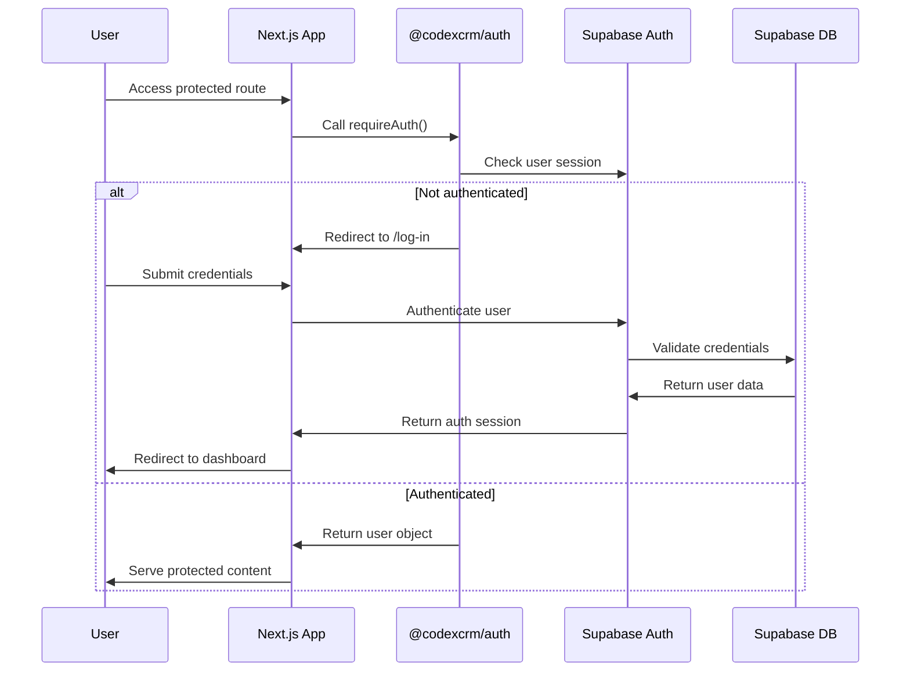
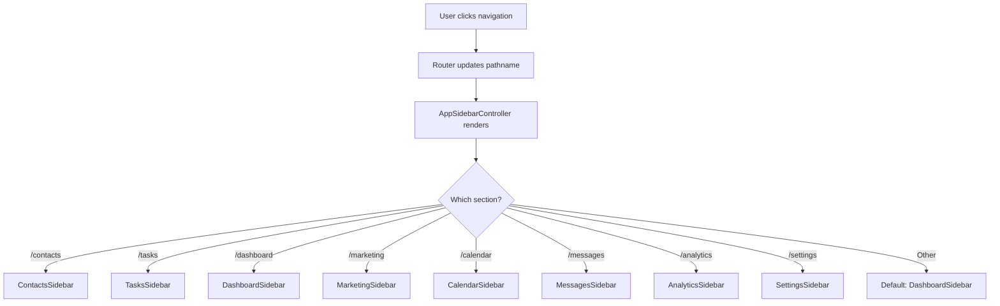
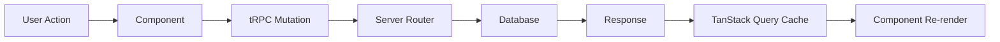

# CodexCRM Architecture Documentation

## 🏗️ System Architecture Overview

CodexCRM is built as a modern, type-safe monorepo using Next.js 15 App Router with React 19, featuring a comprehensive business management platform with enterprise-grade patterns. This documentation reflects the current state of the application as of June 2025.

## 📁 Application Structure

### Core Directory Layout

```
apps/web/
├── app/                          # Next.js 15 App Router
│   ├── (auth)/                   # Authentication route group
│   │   ├── log-in/              # Login page (FUNCTIONAL)
│   │   ├── sign-up/             # Registration page (FUNCTIONAL)
│   │   └── forgot-password/     # Password reset (FUNCTIONAL)
│   ├── api/                     # API routes
│   │   ├── auth/                # Supabase auth handlers
│   │   ├── trpc/                # tRPC endpoint
│   │   └── docs/                # API documentation
│   ├── contacts/                # Contact management (FUNCTIONAL - Only working part)
│   │   ├── [contactId]/         # Dynamic contact routes
│   │   ├── groups/              # Contact groups management
│   │   ├── import/              # CSV/data import tools
│   │   └── new/                 # Contact creation
│   ├── tasks/                   # Task management (MOCK - Coming Soon)
│   ├── dashboard/               # Central hub (MOCK - UI with mock data)
│   ├── marketing/               # Marketing automation (MOCK - UI elements only)
│   ├── calendar/                # Calendar section (UNDER DEVELOPMENT)
│   ├── messages/                # Messages section (UNDER DEVELOPMENT)
│   ├── analytics/               # Analytics section (UNDER DEVELOPMENT)
│   ├── account/                 # Account page under Settings (FUNCTIONAL)
│   ├── docs/                    # Documentation (part of Settings)
│   ├── privacy/                 # Privacy policy (part of Settings)
│   └── terms/                   # Terms of service (part of Settings)
├── components/                  # React components
│   ├── layout/                  # Layout components
│   │   ├── MainLayout.tsx       # Primary application layout
│   │   ├── AppSidebarController.tsx  # Sidebar routing logic
│   │   ├── AppContent.tsx       # Main content area
│   │   └── sidebars/            # All 8 contextual sidebars
│   ├── ui/                      # Base UI components (Shadcn)
│   ├── dashboard/               # 7 Dashboard widgets (mock data)
│   ├── contacts/                # Contact-specific components
│   └── marketing/               # Marketing widget components
└── lib/                         # Utilities and configurations
    ├── auth/                    # Authentication utilities
    ├── supabase/                # Supabase client configurations
    ├── trpc/                    # tRPC client configuration
    └── utils/                   # Shared utilities
```

### Route Status Overview

#### Functional Pages (Full Implementation):

- **Authentication:** `/log-in`, `/sign-up`, `/forgot-password`
- **Contacts:** `/contacts` - The ONLY fully functioning part of the app
  - Contact CRUD operations
  - Group management
  - CSV import/export
  - Contact timeline and details
- **Account:** `/account` - User account management (part of Settings)

#### Mock/UI-Only Pages (Mock Data or UI Elements):

- **Dashboard:** `/dashboard` - Central hub with 7 widgets using mock data
- **Marketing:** `/marketing` - UI elements that will connect to real data later
- **Tasks:** `/tasks` - "Coming Soon" placeholder

#### Under Development:

- **Calendar:** Calendar section (folder exists but under development)
- **Messages:** Messages section (under development)
- **Analytics:** Analytics section (under development)
- **Settings:** Main settings section (under development, only account page works)

#### Static/Legal Pages (Part of Settings):

- **Documentation:** `/docs`
- **Legal:** `/privacy`, `/terms`

## 🔐 Authentication Architecture

### Dual-Package Authentication System

The application uses a sophisticated two-tier authentication system:

1. **@codexcrm/auth Package** - Centralized server-side auth utilities
2. **Local Auth Helpers** - App-specific authentication wrappers

### Authentication Flow Diagram



### Authentication Components

#### Centralized Auth Package (`packages/auth/src/index.ts`)

```typescript
// Server-side authentication utilities
export async function requireAuth(): Promise<User> {
  const { user, error } = await getAuthUser();
  if (!user || error) {
    redirect('/log-in');
  }
  return user;
}

export async function createAuthServerClient() {
  const cookieStore = await cookies();
  return createServerClient(/* Supabase config with cookie handling */);
}
```

#### Local Auth Wrappers (`apps/web/lib/auth/require-auth.ts`)

```typescript
// Re-export centralized auth utilities
export {
  requireAuth,
  getAuthUser,
  getUserId,
  isAuthenticated,
  getUserEmail,
  createAuthServerClient,
  AuthAPI,
} from '@codexcrm/auth';
```

#### Route Protection Pattern

```typescript
// Applied to all protected pages
export default async function ProtectedPage() {
  const user = await requireAuth(); // Automatic redirect if unauthenticated
  return <PageContent user={user} />;
}
```

### Session Management Features

- JWT tokens stored in HTTP-only cookies
- Automatic token refresh via Supabase SSR package
- Server-side validation on every protected route
- Graceful handling of expired sessions
- Google One-Tap integration ready (**`google.d.ts`** present)

## 🧭 Navigation Architecture

### Sidebar Controller System

The application uses a declarative sidebar system that renders contextual navigation based on the current route.

```typescript
// AppSidebarController implementation
export function AppSidebarController() {
  const pathname = usePathname();

  // Route-based sidebar selection
  if (pathname.startsWith('/contacts')) return <ContactsSidebar />;
  if (pathname.startsWith('/tasks')) return <TasksSidebar />;
  if (pathname.startsWith('/dashboard')) return <DashboardSidebar />;
  // ... additional routes

  return <DashboardSidebar />; // Default fallback
}
```

### 8 Main Application Sections + Authentication

#### 1. Dashboard (`/` and `/dashboard`) - MOCK DATA

- **Purpose:** Central hub and business insights overview
- **Status:** UI implemented with 7 widgets using mock data
- **Sidebar:** **`DashboardSidebar`**
- **Components:**
  - **`AiClientInsights`**
  - **`DailyInspirationCard`**
  - **`TherapistCheckIn`**
  - **`CalendarPreview`**
  - **`AiTaskPanel`** (AI Task Approval Table)
  - **`BusinessMetricsCard`**
  - **`QuickActions`**

#### 2. Contacts (`/contacts`) - FUNCTIONAL ✅

- **Purpose:** Customer relationship management
- **Status:** Complete CRUD operations - THE ONLY FULLY FUNCTIONING PART
- **Sidebar:** **`ContactsSidebar`**
- **Key Features:**
  - Contact CRUD operations
  - Group management with many-to-many relationships
  - CSV import/export functionality
  - Advanced search and filtering
  - Contact timeline and activity tracking
  - Custom field support
  - Avatar/image upload

### 3. Tasks (`/tasks`) - MOCK/PLACEHOLDER

- **Purpose:** Project and task management
- **Status:** Placeholder page with "Coming Soon" message
- **Sidebar:** **`TasksSidebar`**
- **Planned Features:**
  - Kanban board interface
  - Task assignment and tracking
  - Priority and status management
  - Due date and reminder system
  - Project organization
  - Team collaboration tools
  - Contact-linked tasks for CRM workflow

### 4. Messages (`/messages`) - UNDER DEVELOPMENT

- **Purpose:** Communication hub
- **Status:** Sidebar exists, main section under development
- **Sidebar:** **`MessagesSidebar`**
- **Planned Features:**
  - Internal messaging
  - Email integration
  - SMS communication
  - Communication history

### 5. Calendar (`/calendar`) - UNDER DEVELOPMENT

- **Purpose:** Scheduling and appointments
- **Status:** Sidebar exists, main section under development
- **Sidebar:** **`CalendarSidebar`**
- **Planned Features:**
  - Appointment booking
  - Event management
  - Calendar integration
  - Time blocking

### 6. Marketing (`/marketing`) - MOCK UI ELEMENTS

- **Purpose:** Marketing automation and campaign management
- **Status:** UI elements that will connect to real data later
- **Sidebar:** **`MarketingSidebar`**
- **Features:**
  - Email marketing widgets
  - Content calendar widget
  - Lead magnet studio widget
  - Quiz creator widget
  - Creator studio widget
  - Membership/loyalty programs widget

### 7. Analytics (`/analytics`) - UNDER DEVELOPMENT

- **Purpose:** Advanced reporting and business intelligence
- **Status:** Sidebar exists, main section under development
- **Sidebar:** **`AnalyticsSidebar`**
- **Planned Features:**
  - Custom report builder
  - Data visualization
  - Performance metrics
  - Business intelligence dashboards

### 8. Settings (`/settings`) - PARTIALLY FUNCTIONAL

- **Purpose:** Account and system configuration
- **Status:** Only account page works, main settings under development
- **Sidebar:** **`SettingsSidebar`**
- **Current Features:**
  - Account management (`/account`) - ✅ FUNCTIONAL
- **Planned Features:**
  - User preferences
  - System configuration
  - Security settings
- **Sub-sections (Static/Legal):**
  - Documentation (`/docs`)
  - Privacy Policy (`/privacy`)
  - Terms of Service (`/terms`)

### 9. Authentication (`/(auth)`) - FUNCTIONAL ✅

- **Routes:** `/log-in`, `/sign-up`, `/forgot-password`
- **Status:** Complete authentication flow
- **Features:**
  - Email/password authentication
  - Password reset functionality
  - Registration with email confirmation
  - Google One-Tap integration ready

## Navigation Flow



## 🔗 API Architecture (tRPC)

### Current tRPC Router Structure (Cleaned Up)

```
packages/server/src/routers/
├── contact.ts              # Contact management endpoints (ACTIVE)
├── group.ts                # Group management endpoints (ACTIVE)
├── storage.ts              # File upload endpoints for photos (ACTIVE)
├── dashboard.ts            # Dashboard metrics (ACTIVE)
└── root.ts                 # Main app router aggregation
```

### Removed Routers:

- **`ai-action.ts`** - Removed to avoid developer confusion
- **`session.ts`** - Removed as sessions not implemented yet
- **`note.ts`** - Removed as notes functionality not implemented
- **`task.ts`** - Already removed as tasks module is placeholder

### API Endpoint Patterns

#### Contact Router (`/api/trpc/contacts`)

```typescript
export const contactRouter = createTRPCRouter({
  // List contacts with pagination and filtering
  list: protectedProcedure
    .input(
      z.object({
        page: z.number().min(1).default(1),
        limit: z.number().min(1).max(100).default(10),
        search: z.string().optional(),
        groupId: z.string().optional(),
      })
    )
    .query(async ({ input, ctx }) => {
      // Implementation with Supabase query
    }),

  // Create or update contact
  save: protectedProcedure.input(ContactSchema).mutation(async ({ input, ctx }) => {
    // Upsert logic with validation
  }),

  // Delete contact
  delete: protectedProcedure
    .input(z.object({ id: z.string() }))
    .mutation(async ({ input, ctx }) => {
      // Soft delete with referential integrity
    }),
});
```

#### Storage Router (`/api/trpc/storage`)

```typescript
export const storageRouter = createTRPCRouter({
  // File upload for photos and avatars
  uploadPhoto: protectedProcedure.mutation(/* Photo upload logic */),
  deletePhoto: protectedProcedure.mutation(/* Photo deletion logic */),
});
```

#### Dashboard Router (`/api/trpc/dashboard`)

```typescript
export const dashboardRouter = createTRPCRouter({
  getMetrics: protectedProcedure.query(/* Business metrics aggregation */),
  aiActionMetrics: protectedProcedure.query(/* AI task panel data */),
});
```

### Middleware Architecture

#### Authentication Middleware

```typescript
const protectedProcedure = publicProcedure.use(async ({ ctx, next }) => {
  if (!ctx.user) {
    throw new TRPCError({ code: 'UNAUTHORIZED' });
  }
  return next({ ctx: { ...ctx, user: ctx.user } });
});
```

#### Rate Limiting Middleware

```typescript
const rateLimitedProcedure = protectedProcedure.use(async ({ ctx, next }) => {
  // Implement rate limiting logic
  const isAllowed = await checkRateLimit(ctx.user.id);
  if (!isAllowed) {
    throw new TRPCError({ code: 'TOO_MANY_REQUESTS' });
  }
  return next();
});
```

## 💾 Database Architecture

### Supabase Schema Design

#### Current Active Tables (from Supabase)

Based on the current database structure, active tables include:

**Core Functional Tables:**

- **`contacts`** - Contact management with full CRUD operations
- **`groups`** - Contact grouping and categorization (renamed from contact_groups)
- **`group_members`** - Many-to-many relationship table

#### Core Tables Schema (Active)

```sql
-- Users (managed by Supabase Auth)

-- Contacts
CREATE TABLE contacts (
  id UUID PRIMARY KEY DEFAULT gen_random_uuid(),
  user_id UUID REFERENCES auth.users(id) ON DELETE CASCADE,
  email TEXT,
  phone TEXT,
  job_title TEXT,
  source TEXT,
  notes TEXT,
  last_contacted_at TIMESTAMPTZ,
  enrichment_status TEXT,
  enriched_data jsonb,
  created_at TIMESTAMPTZ ,
  updated_at TIMESTAMPTZ ,
  company_name TEXT,
  profile_image_url TEXT,
  website TEXT,
  tags TEXT[],
  full_name TEXT NOT NULL,
  social_handles TEXT[],
  address_street TEXT,
  address_city TEXT,
  address_postal_code TEXT,
  address_country TEXT,
  phone_country_code TEXT,
  wellness_goals TEXT[],
  wellness_journey_stage TEXT,
  wellness_status TEXT,
  last_assessment_date TIMESTAMPTZ,
  client_since TIMESTAMPTZ,
  relationship_status TEXT,
  referral_source TEXT,
  communication_preferences jsonb,
);

-- Groups (Contact Groups)
CREATE TABLE groups (
  id UUID PRIMARY KEY DEFAULT gen_random_uuid(),
  user_id UUID REFERENCES auth.users(id) ON DELETE CASCADE,
  name TEXT NOT NULL,
  description TEXT,
  color TEXT,
  emoji TEXT,
  created_at TIMESTAMPTZ,
  updated_at TIMESTAMPTZ
);

-- Group Members (Many-to-Many)
CREATE TABLE group_members (
  id UUID PRIMARY KEY DEFAULT gen_random_uuid(),
  contact_id UUID REFERENCES contacts(id) ON DELETE CASCADE,
  group_id UUID REFERENCES groups(id) ON DELETE CASCADE,
  contact_id UUID REFERENCES contacts(id) ON DELETE CASCADE,
  created_at TIMESTAMPTZ ,
  UNIQUE(contact_id, group_id)
);
```

#### Database Status

- **Active & Functional:** Contact and group management
- **Legacy/Future:** All other tables have been removed.

#### Row Level Security (RLS)

```sql
-- Enable RLS for all tables
ALTER TABLE contacts ENABLE ROW LEVEL SECURITY;
ALTER TABLE groups ENABLE ROW LEVEL SECURITY;
ALTER TABLE group_members ENABLE ROW LEVEL SECURITY;

-- Users can only access their own data
CREATE POLICY "Users can manage their own contacts" ON contacts
  FOR ALL USING (auth.uid() = user_id);

CREATE POLICY "Users can manage their own groups" ON groups
  FOR ALL USING (auth.uid() = user_id);
```

## 🎨 UI Architecture

### Layout Component Hierarchy

```
MainLayout
└── AppContent
    ├── AppSidebarController
    │   └── [Selected Sidebar]
    │       ├── DashboardSidebar
    │       ├── ContactsSidebar
    │       ├── TasksSidebar
    │       ├── MessagesSidebar
    │       ├── CalendarSidebar
    │       ├── MarketingSidebar
    │       ├── AnalyticsSidebar
    │       └── SettingsSidebar
    └── SidebarInset
        ├── Header
        │   ├── SidebarTrigger
        │   ├── DynamicBreadcrumb
        │   └── MainSectionNav
        └── Main
            └── [Page Content]
```

### Sidebar Structure

```
Sidebar (any of the 8 sidebars)
├── SidebarHeader
│   └── Logo
├── SidebarContent (Central Sections)
│   ├── Navigation Links
│   ├── Quick Actions
│   └── Context-specific Widgets
└── SidebarFooter
    └── UserNav
        ├── Account Page Access
        └── Settings Pages Access
```

#### Layout Flow:

1. **MainLayout** - Root layout component
2. **AppContent** - Main content wrapper
3. **AppSidebarController** - Determines which sidebar to show based on route
4. **Selected Sidebar** - One of 8 contextual sidebars with header, content, and footer
5. **SidebarInset** - Main content area next to sidebar
6. **Header** - Contains sidebar trigger, breadcrumbs, and main navigation
7. **Main** - Actual page content area

### Design System (Shadcn UI)

#### Core Components

- **Button**, **Input**, **Textarea** (form elements)
- **Card**, **Badge**, **Avatar** (content display)
- **Dialog**, **Sheet**, **Popover** (overlays)
- **Table**, **Pagination** (data display)
- **Skeleton**, **Loading Spinner** (loading states)

#### Custom Components

- **ContactForm** (with validation)
- **TaskBoard** (Kanban interface)
- **BusinessMetricsCard** (analytics)
- **ImageUpload** (file handling)

### Responsive Design

#### Breakpoint Strategy

```javascript
// Tailwind breakpoints used throughout
sm: '640px',   // Small devices
md: '768px',   // Medium devices
lg: '1024px',  // Large devices
xl: '1280px',  // Extra large devices
2xl: '1536px'  // 2x extra large devices
```

#### Mobile-First Approach

- Collapsible sidebar on mobile
- Touch-optimized interactive elements
- Progressive enhancement for larger screens
- Responsive typography and spacing

## ⚡ Performance Architecture

### Bundle Optimization

#### Code Splitting Strategy

```javascript
// Dynamic imports for route-based splitting
const ContactsPage = dynamic(() => import('./contacts/page'), {
  loading: () => <ContactsPageSkeleton />,
});

// Component-level splitting for heavy components
const TaskBoard = dynamic(() => import('./TaskBoard'), {
  loading: () => <TaskBoardSkeleton />,
});
```

#### Progressive Loading

- Skeleton UI for all loading states
- Incremental data loading with pagination
- Image optimization with Next.js Image component
- Lazy loading for non-critical components

### React 19 Concurrent Features

#### useTransition for Non-blocking Navigation

```javascript
function NavigationLink({ href, children }) {
  const [isPending, startTransition] = useTransition();
  const router = useRouter();

  const handleClick = () => {
    startTransition(() => {
      router.push(href);
    });
  };

  return (
    <button onClick={handleClick} disabled={isPending}>
      {isPending ? <LoadingSpinner /> : children}
    </button>
  );
}
```

#### useOptimistic for Instant Updates

```javascript
function ContactList() {
  const [contacts, setContacts] = useState(initialContacts);
  const [optimisticContacts, addOptimisticContact] = useOptimistic(
    contacts,
    (state, newContact) => [...state, newContact]
  );

  const createContact = async (contactData) => {
    addOptimisticContact({ ...contactData, id: 'temp-id' });
    try {
      const savedContact = await api.contacts.save(contactData);
      setContacts((current) => [...current, savedContact]);
    } catch (error) {
      // Optimistic update will be reverted automatically
      showErrorToast('Failed to create contact');
    }
  };
}
```

## 🔒 Security Architecture

### Authentication Security

- JWT tokens with automatic refresh
- HTTP-only cookies for token storage
- Server-side session validation
- Secure redirect handling
- CSRF protection via SameSite cookies

### Data Security

- Row Level Security (RLS) in Supabase
- Input validation with Zod schemas
- SQL injection prevention
- XSS protection via React's built-in escaping
- Content Security Policy headers

### API Security

- Rate limiting middleware
- Request validation on all endpoints
- User authorization checks
- Error message sanitization
- Audit logging for sensitive operations

## 🔍 Code Quality & Error Handling

### Error Monitoring (Sentry Integration)

The application includes Sentry for comprehensive error tracking:

**Sentry Configuration Files:**

- **`sentry.server.config.ts`** - Server-side error tracking
- **`sentry.edge.config.ts`** - Edge runtime error tracking
- API example endpoint for testing error reporting

#### Error Boundaries

```javascript
class ComponentErrorBoundary extends React.Component {
  state = { hasError: false };

  static getDerivedStateFromError(error) {
    return { hasError: true };
  }

  componentDidCatch(error, errorInfo) {
    // Sentry integration for error reporting
    console.error('Component error:', error, errorInfo);
  }

  render() {
    if (this.state.hasError) {
      return <ErrorFallbackUI />;
    }
    return this.props.children;
  }
}
```

### Code Quality Tools

#### ESLint Configuration (`eslint.config.js`)

- TypeScript ESLint with strict rules
- React 19 specific configurations
- Next.js Core Web Vitals rules
- Custom rules for code quality
- Monorepo-aware configuration

#### Prettier Configuration (`.prettierrc`)

```json
{
  "printWidth": 100,
  "tabWidth": 2,
  "useTabs": false,
  "semi": true,
  "singleQuote": true,
  "trailingComma": "es5",
  "bracketSpacing": true,
  "arrowParens": "always"
}
```

#### Key Quality Features:

- Consistent code formatting across the monorepo
- TypeScript strict mode enabled
- Import/export validation
- React Hooks rules enforcement
- Next.js best practices validation

### Global Error Handling

- tRPC error handling with user-friendly messages
- Network error recovery with retry logic
- Graceful degradation for failed components
- Comprehensive error reporting via Sentry

### Performance Monitoring

- Core Web Vitals tracking
- Bundle size monitoring
- Database query performance
- API response time metrics
- User interaction analytics

## 🔄 Data Flow Architecture

### State Management Pattern



#### Client-Side State

- TanStack Query for server state management
- React state for local component state
- URL state for navigation and filters
- Local storage for user preferences

#### Server-Side State

- Supabase database as source of truth
- tRPC procedures for data mutations
- Automatic cache invalidation
- Optimistic updates with rollback

## 📁 File Organization & App Router Compliance

### Current vs. Desired Structure

The application currently follows a mixed approach to file organization. The desired final outcome is to move toward modern Next.js App Router patterns:

#### Current Structure:

- Components are mostly in `/components` outside the app directory
- Some route-specific components are co-located with routes
- Global utilities in `/lib`

#### Target Structure (per Next.js App Router best practices):

- Route groups for organization: **`(contacts)`**, **`(tasks)`**, **`(marketing)`**
- Co-located components within route segments
- Private folders for non-routable organization: **`_components`**, **`_lib`**
- Shared components in root **`/components`**

#### Example Target Structure:

```
app/
├── (contacts)/           # Route group for contacts
│   ├── contacts/
│   │   ├── _components/   # Private folder for contact components
│   │   ├── _lib/         # Private folder for contact utilities
│   │   ├── [contactId]/
│   │   └── page.tsx
│   └── layout.tsx        # Contacts-specific layout
└── (tasks)/              # Route group for tasks (when implemented)
    ├── tasks/
    └── layout.tsx
```

### Build Artifacts & Configuration Files

#### tsconfig.tsbuildinfo (`apps/web/tsconfig.tsbuildinfo`)

- **Purpose:** TypeScript incremental compilation cache
- **Necessity:** Should be in .gitignore, helps with build performance
- **Location:** Correct in **`apps/web`** root
- **Status:** ✅ Necessary for build optimization

#### google.d.ts (`apps/web/google.d.ts`)

- **Purpose:** TypeScript declarations for Google One-Tap integration
- **Current Location:** **`apps/web/google.d.ts`**
- **Recommended Location:** Should be in **`apps/web/types/`** or **`apps/web/lib/types/`**
- **Content:** Provides global Window interface extensions for Google APIs
- **Status:** ⚠️ Should be moved to better location for organization

### Compliance Notes

1. **Route Groups:** Not yet implemented but planned for better organization
2. **Private Folders:** Could be used for better component organization
3. **Co-location:** Partially implemented, could be improved
4. **Layout Optimization:** Currently using a single layout, could benefit from route-specific layouts

---

This architecture provides a solid foundation for a scalable, maintainable, and performant business management platform with enterprise-grade security and user experience patterns. The application is actively used for contact management and marketing automation, with task management planned for future development.
