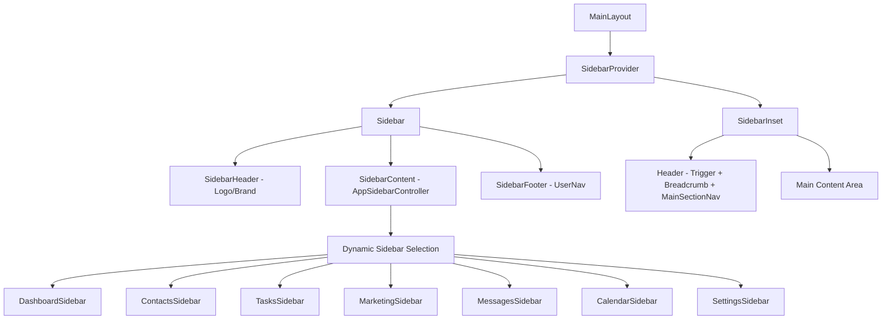
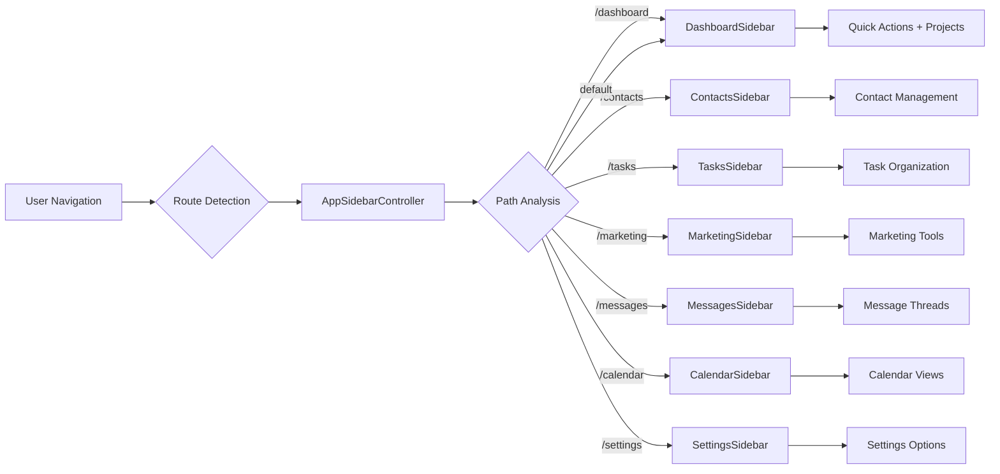

# OmniCRM Layout Architecture

## Overview

The OmniCRM application uses a sophisticated layout system built on Shadcn UI's Sidebar components with dynamic sidebar switching based on the active navigation section. The layout provides a consistent user experience while allowing each section to have its own contextual navigation.

## Architecture Components

### 1. Core Layout Structure



### 2. Navigation Flow



## Component Hierarchy

### MainLayout (`components/layout/MainLayout.tsx`)
- **Purpose**: Root layout wrapper providing the overall structure
- **Responsibilities**:
  - Manages SidebarProvider state
  - Contains header with trigger, breadcrumbs, and main navigation
  - Renders main content area
- **Key Features**:
  - Mobile-responsive sidebar behavior
  - Consistent header across all sections
  - Logo/brand display in sidebar header

### AppSidebarController (`components/layout/AppSidebarController.tsx`)
- **Purpose**: Dynamic sidebar selection based on current route
- **Logic**:
  ```typescript
  if (pathname.startsWith('/dashboard')) return <DashboardSidebar />
  if (pathname.startsWith('/contacts')) return <ContactsSidebar />
  if (pathname.startsWith('/tasks')) return <TasksSidebar />
  if (pathname.startsWith('/marketing')) return <MarketingSidebar />
  if (pathname.startsWith('/messages')) return <MessagesSidebar />
  if (pathname.startsWith('/calendar')) return <CalendarSidebar />
  if (pathname.startsWith('/settings')) return <SettingsSidebar />
  return <DashboardSidebar /> // Default fallback
  ```

### MainSectionNav (`components/layout/MainSectionNav.tsx`)
- **Purpose**: Top-level navigation between main sections
- **Sections**:
  - Dashboard (Home)
  - Contacts
  - Tasks
  - Calendar
  - Messages
  - Marketing
  - Analytics
- **Features**:
  - Icon + text display on large screens
  - Icon-only on medium screens
  - Hidden on mobile (handled by sidebar)

## Section-Specific Sidebars

### 1. DashboardSidebar
- **Context**: Main dashboard and overview
- **Navigation Groups**:
  - Quick Actions (Add Contact, Create Group, Add Task)
  - Business Goals (Content Calendar, Workshops, Schedule)
  - Schedule (Appointments, Notes, Availability)
  - Settings (Help, Upgrade, Support, Account)
- **Dynamic Content**: Projects list with progress indicators

### 2. ContactsSidebar
- **Context**: Contact and relationship management
- **Navigation Groups**:
  - Contacts (All Contacts, Groups, Import, Add Contact)
  - Quick Actions
  - Groups List (Dynamic)
- **Features**: Group management and contact organization

### 3. TasksSidebar
- **Context**: Task and project management
- **Navigation Groups**:
  - Task Management (Dashboard, Inbox, Today, Upcoming, etc.)
  - Quick Actions (New Task, New Project, Quick Capture, Time Tracker)
  - Active Projects (with progress bars)
  - Productivity Tools (Focus Mode, Pomodoro, Team Tasks, Analytics)
- **Features**: GTD-style organization with time-based views

### 4. MarketingSidebar
- **Context**: Marketing campaigns and content creation
- **Navigation Groups**:
  - Marketing Tools (Dashboard, Campaigns, Email, Social, Content, Website, Referrals)
  - Create Content (Email Campaign, Social Post, Blog, Video, Newsletter, Promotions)
  - Active Campaigns (with status indicators)
  - Wellness Templates (Yoga, Nutrition, Mindfulness, Seasonal)
- **Features**: Campaign tracking and content creation workflows

### 5. MessagesSidebar
- **Context**: Communication and messaging
- **Navigation Groups**:
  - Messages (Inbox, Sent, Starred, Archived)
  - Quick Actions (New Message, Broadcast, Schedule)
  - Recent Conversations (with unread counts)
- **Features**: Thread management and communication tools

### 6. CalendarSidebar
- **Context**: Scheduling and appointments
- **Status**: Currently minimal implementation
- **Planned Features**: Date pickers, event filters, appointment management

## Breadcrumb System

### DynamicBreadcrumb (`components/layout/DynamicBreadcrumb.tsx`)
- **Purpose**: Shows current page hierarchy
- **Configuration**: Uses `lib/breadcrumb-config.ts` for route mapping
- **Features**:
  - Dynamic route detection
  - Parent-child relationship mapping
  - Support for dynamic routes with parameters

### Route Configuration Structure
```typescript
export const routeConfig: Record<string, RouteConfig> = {
  '/': { label: 'Dashboard', icon: Home },
  '/contacts': { label: 'Contacts', parent: '/' },
  '/contacts/new': { label: 'New Contact', parent: '/contacts' },
  // ... more routes
}
```

## Layout Patterns

### 1. Consistent Header Structure
All sidebars follow the same header pattern:
```typescript
<SidebarHeader>
  <Link href="/" className="flex items-center gap-2 font-semibold">
    
    <div className="flex flex-col group-data-[collapsible=icon]:hidden">
      <span>OmniCRM</span>
      <span className="text-xs">by <span className="text-teal-500">Omnipotency ai</span></span>
    </div>
  </Link>
</SidebarHeader>
```

### 2. Consistent Footer Structure
All sidebars use the same footer:
```typescript
<SidebarFooter>
  <UserNav />
</SidebarFooter>
```

### 3. Content Organization
Each sidebar organizes content into logical groups using:
- `SidebarGroup` for section containers
- `SidebarGroupLabel` for section headers
- `SidebarMenu` and `SidebarMenuItem` for navigation items

## Mobile Responsiveness

### Sidebar Behavior
- **Desktop**: Collapsible sidebar with icon/full modes
- **Mobile**: Overlay sidebar that can be toggled
- **Trigger**: SidebarTrigger in header for manual control

### Navigation Adaptation
- **MainSectionNav**: Hidden on mobile, accessible via sidebar
- **Breadcrumbs**: Responsive text sizing
- **Content**: Full-width on mobile when sidebar is collapsed

## State Management

### Sidebar State
- Managed by `SidebarProvider` from Shadcn UI
- Persistent across route changes
- Responsive behavior built-in

### Active State Detection
- Uses `usePathname()` hook for route detection
- Active states applied to navigation items
- Breadcrumb generation based on current path

## Extension Points

### Adding New Sections
1. Create new sidebar component in section directory
2. Add route detection logic to `AppSidebarController`
3. Add route configuration to `breadcrumb-config.ts`
4. Add navigation item to `MainSectionNav`

### Customizing Existing Sidebars
1. Modify section-specific sidebar component
2. Update navigation groups and items
3. Add any required API integrations for dynamic content

## Best Practices

### Sidebar Design
- Consistent header/footer across all sidebars
- Logical grouping of related functionality
- Clear visual hierarchy with icons and labels
- Badge indicators for counts and status

### Navigation
- Descriptive labels and appropriate icons
- Active state indication
- Logical information architecture
- Responsive behavior consideration

### Performance
- Lazy loading of sidebar content where appropriate
- Efficient route detection logic
- Minimal re-renders on navigation changes

## Current Implementation Status

### ✅ Completed
- MainLayout structure
- AppSidebarController routing
- DashboardSidebar (full implementation)
- ContactsSidebar (full implementation)
- TasksSidebar (full implementation)
- MarketingSidebar (full implementation)
- MessagesSidebar (full implementation)
- MainSectionNav
- DynamicBreadcrumb system

### 🚧 In Progress
- CalendarSidebar (minimal implementation)
- Settings sidebar integration

### 📋 Planned
- Analytics section sidebar
- Advanced breadcrumb features
- Sidebar customization options
- Enhanced mobile navigation

## Technical Considerations

### Dependencies
- `@/components/ui/sidebar` (Shadcn UI)
- `next/navigation` for routing
- `lucide-react` for icons
- Custom UI components from `@codexcrm/ui`

### File Organization
```
apps/web/
├── components/layout/
│   ├── MainLayout.tsx
│   ├── AppSidebarController.tsx
│   ├── MainSectionNav.tsx
│   └── DynamicBreadcrumb.tsx
├── app/(authorisedRoute)/
│   ├── dashboard/_components/DashboardSidebar.tsx
│   ├── contacts/_components/ContactsSidebar.tsx
│   ├── tasks/TasksSidebar.tsx
│   ├── marketing/MarketingSidebar.tsx
│   ├── messages/MessagesSidebar.tsx
│   └── calendar/CalendarSidebar.tsx
└── lib/
    └── breadcrumb-config.ts
```

This architecture provides a scalable, maintainable layout system that can easily accommodate new sections and features while maintaining consistency across the application.