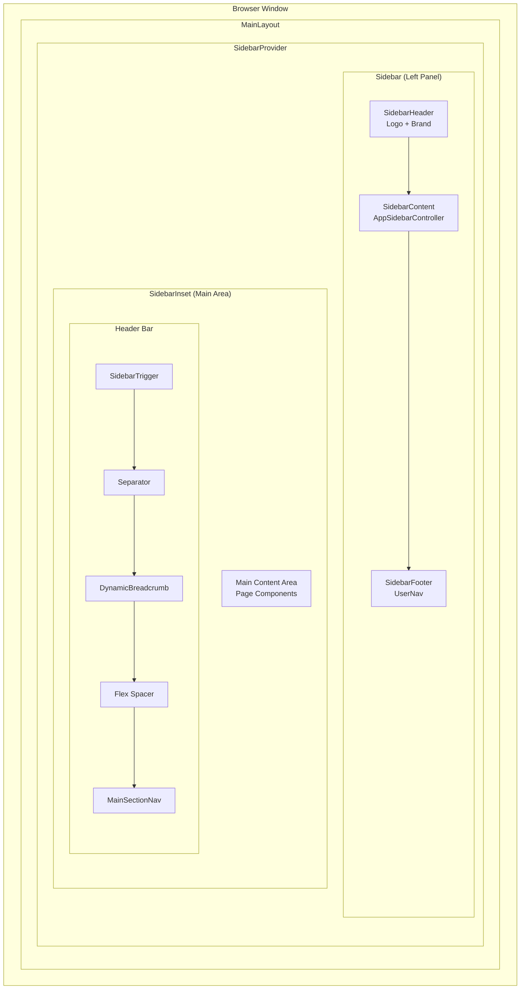
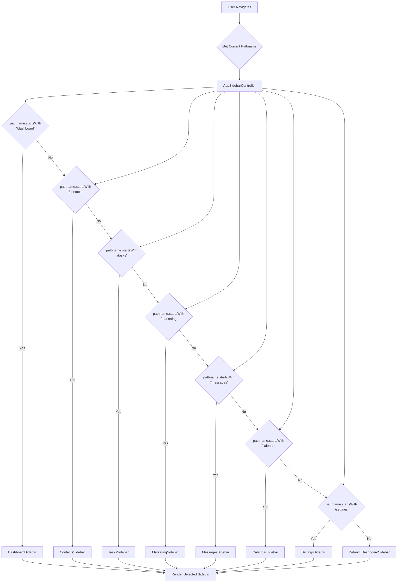
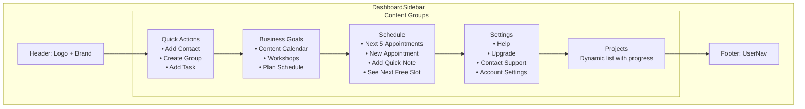
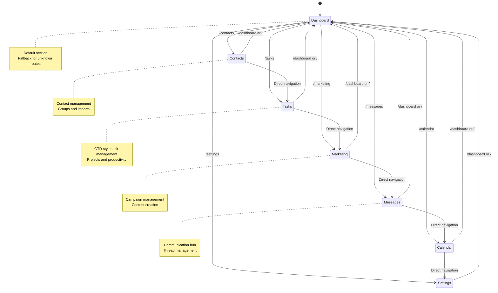
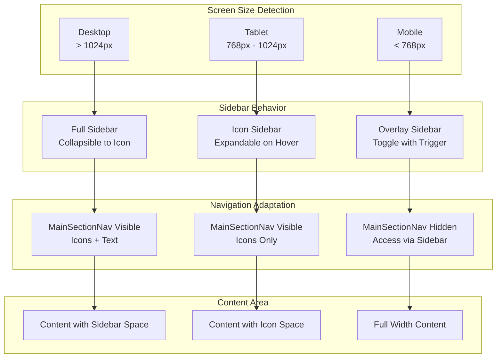
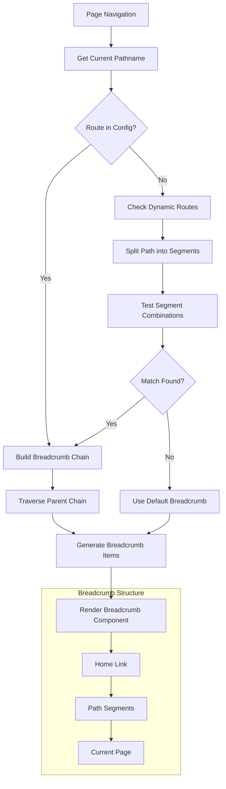
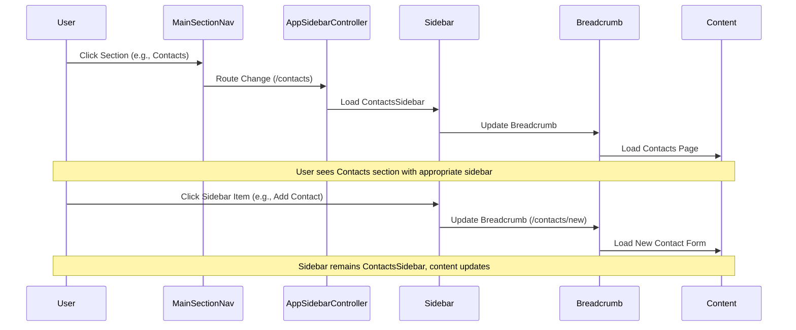

# OmniCRM Layout Flow Diagrams

## 1. Overall Application Layout Structure



## 2. Sidebar Controller Decision Flow



## 3. Section-Specific Sidebar Structures

### Dashboard Sidebar Structure


### Contacts Sidebar Structure
```mermaid
graph TD
    subgraph "ContactsSidebar"
        CSH[Header: Logo + Brand]
        
        subgraph "Content Groups"
            CONT[Contacts<br/>• All Contacts<br/>• Groups<br/>• Import Contacts<br/>• Add Contact]
            QAC[Quick Actions<br/>Placeholder for future actions]
            GRPS[Groups<br/>Dynamic groups list<br/>Currently: "No groups found"]
        end
        
        CSF[Footer: UserNav]
    end
    
    CSH --> CONT
    CONT --> QAC
    QAC --> GRPS
    GRPS --> CSF
```

### Tasks Sidebar Structure
```mermaid
graph TD
    subgraph "TasksSidebar"
        TSH[Header: Logo + Brand]
        
        subgraph "Content Groups"
            TM[Task Management<br/>• Dashboard<br/>• Inbox (12)<br/>• Today (5)<br/>• Upcoming<br/>• Anytime<br/>• Someday<br/>• Completed]
            QAT[Quick Actions<br/>• New Task<br/>• New Project<br/>• Quick Capture<br/>• Time Tracker]
            AP[Active Projects<br/>Dynamic list with progress bars]
            PT[Productivity<br/>• Focus Mode<br/>• Pomodoro Timer<br/>• Team Tasks<br/>• Analytics]
            TSET[Settings<br/>• Task Settings]
        end
        
        TSF[Footer: UserNav]
    end
    
    TSH --> TM
    TM --> QAT
    QAT --> AP
    AP --> PT
    PT --> TSET
    TSET --> TSF
```

### Marketing Sidebar Structure
```mermaid
graph TD
    subgraph "MarketingSidebar"
        MSH[Header: Logo + Brand]
        
        subgraph "Content Groups"
            MT[Marketing Tools<br/>• Dashboard<br/>• Campaigns (4)<br/>• Email Marketing<br/>• Social Media<br/>• Content Library<br/>• Website & SEO<br/>• Referral Program]
            CC[Create Content<br/>• New Email Campaign<br/>• Social Media Post<br/>• Blog Post<br/>• Video Content<br/>• Newsletter<br/>• Special Offer]
            AC[Active Campaigns<br/>Dynamic list with status]
            WT[Wellness Templates<br/>• Yoga & Meditation<br/>• Nutrition & Wellness<br/>• Mindfulness & Self-Care<br/>• Seasonal Campaigns]
            MSET[Settings<br/>• Marketing Settings]
        end
        
        MSF[Footer: UserNav]
    end
    
    MSH --> MT
    MT --> CC
    CC --> AC
    AC --> WT
    WT --> MSET
    MSET --> MSF
```

### Messages Sidebar Structure
```mermaid
graph TD
    subgraph "MessagesSidebar"
        MESH[Header: Logo + Brand]
        
        subgraph "Content Groups"
            MN[Messages<br/>• Inbox (6)<br/>• Sent<br/>• Starred (2)<br/>• Archived]
            QAM[Quick Actions<br/>• New Message<br/>• Send Broadcast<br/>• Schedule Message]
            RC[Recent Conversations<br/>Dynamic list with:<br/>• Contact avatars<br/>• Last message preview<br/>• Unread counts<br/>• Timestamps]
            MESET[Settings<br/>• Message Settings]
        end
        
        MESF[Footer: UserNav]
    end
    
    MESH --> MN
    MN --> QAM
    QAM --> RC
    RC --> MESET
    MESET --> MESF
```

## 4. Navigation State Flow



## 5. Responsive Behavior Flow



## 6. Breadcrumb Generation Flow



## 7. User Interaction Flow



This comprehensive flow diagram system shows how all the layout components work together to provide a seamless, responsive user experience across different sections of the OmniCRM application.